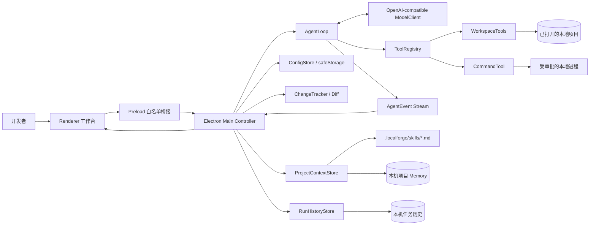
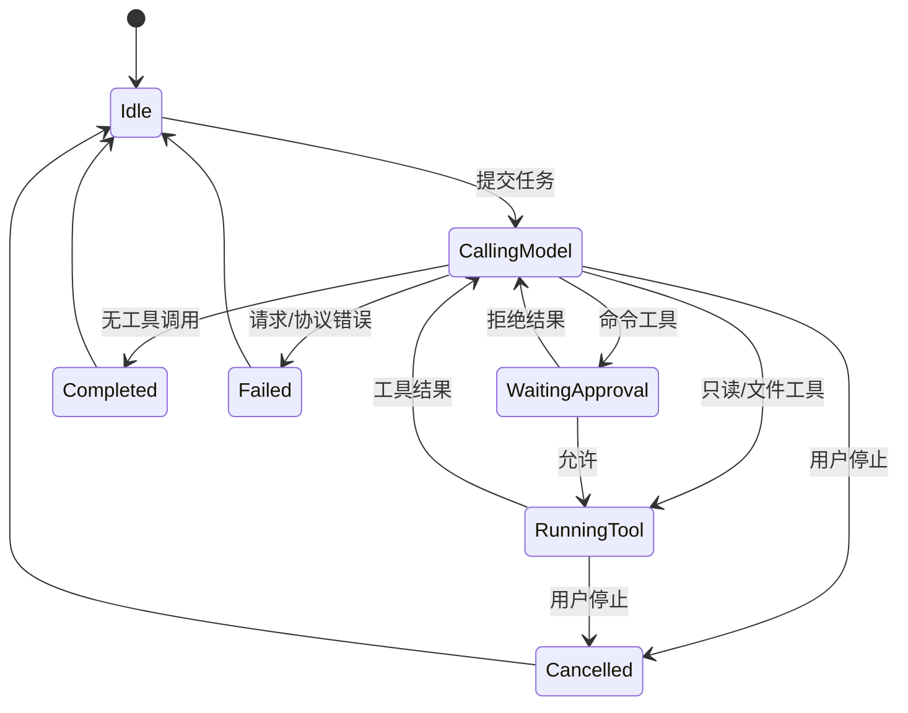

# 总体设计文档

## 1. 设计目标

LocalForge 必须让用户知道 Agent 正在做什么、为什么需要权限、修改了哪些代码以及怎样验证。独立桌面壳只负责项目导航、代码只读预览和过程呈现；核心工作是可解释、可停止、可测试的本地 Agent 闭环。

## 2. 总体架构



## 3. 进程与模块职责

| 模块 | 职责 | 不负责的内容 |
| --- | --- | --- |
| `renderer/app.ts` | 项目树、只读代码、时间线、审批、输出与 Diff | 文件系统和模型网络访问 |
| `preload.ts` | 通过 contextBridge 暴露固定 IPC API | 任意 Node API 或动态通道 |
| `main.ts` | 窗口安全策略、项目状态、IPC、任务编排和审批解析 | 决定模型下一步行为 |
| `desktop/projectService.ts` | 过滤项目树、限制文件预览、真实路径检查 | 修改文件 |
| `desktop/configStore.ts` | 配置验证、系统加密存储、环境变量覆盖 | 向 Renderer 暴露 Key 明文 |
| `desktop/projectContextStore.ts` | Skill 发现、Memory 隔离存储、上下文限制 | 自动执行 Skill 或修改项目文件 |
| `desktop/runHistoryStore.ts` | 按项目记录任务状态、事件、消息摘要和改动文件 | 保存 API Key 或写入用户项目 |
| `agent/systemPrompt.ts` | 合并固定安全提示、Memory 和选中 Skill | 信任过期记忆代替读取代码 |
| `agent/agentLoop.ts` | 消息历史、工具调度、循环、取消、终止和事件 | 具体工具实现 |
| `model/openAICompatibleClient.ts` | HTTP、严格响应解析和 tool call 协议校验 | 自动执行工具 |
| `agent/toolRegistry.ts` | 工具 schema、调用和统一错误结果 | UI 渲染 |
| `tools/workspaceTools.ts` | 列表、搜索、读取、修改、命令和边界保护 | Git 提交与推送 |
| `agent/changeTracker.ts` | 首次写入前快照和变更集合 | 撤销与版本控制 |

## 4. Agent 循环

```text
initialize(system, task, tools, limits)
for step in 1..maxSteps:
    assistant = model.complete(messages, tools, signal)
    append assistant
    if assistant has no tool calls:
        finish with its summary
    for call in assistant.toolCalls:
        parse arguments
        execute registered tool or return structured error
        append result with the same tool_call_id
        emit observable event
fail safely when the step limit is exhausted
```

- 普通模型文本不能改变工作区；只有注册工具能产生本地副作用。
- 工具调用和结果严格按 `tool_call_id` 配对。
- 已进入循环的参数或工具错误被规范化并反馈模型，不破坏消息序列；模型响应本身结构损坏时明确失败。
- AbortSignal 同时控制模型请求、AgentLoop 和本地进程。

## 5. 状态机



## 6. 工具协议

| 工具 | 核心参数 | 输出 | 权限 |
| --- | --- | --- | --- |
| `list_files` | `glob`, `limit` | 相对路径列表 | 自动，只读 |
| `search_text` | `query`, `include`, `limit` | 文件、行号、文本 | 自动，只读 |
| `read_file` | `path`, `startLine`, `endLine` | 带行号内容 | 自动，只读 |
| `replace_in_file` | `path`, `oldText`, `newText` | 修改统计 | 自动，项目内写入 |
| `write_file` | `path`, `content` | 创建/覆盖结果 | 自动，项目内写入 |
| `run_command` | `command`, `reason` | exit code、输出、超时、批准等待与执行耗时 | 每次人工批准 |

文件路径先做词法范围检查，再对既有目标或最近既有父目录做 `realpath` 检查。符号链接被跳过；依赖、缓存和构建目录不会进入默认遍历。命令 cwd 固定为项目根目录，输出保留长度受配置限制。命令工具分别记录人工批准等待与本地进程执行耗时，AgentLoop 的整次工具调用耗时仍可用于总链路分析，两者不能混为性能数据。

## 7. 桌面安全边界

- Renderer 启用 `contextIsolation` 和 `sandbox`，关闭 `nodeIntegration`。
- Preload 只暴露预定义方法，不向页面提供 `ipcRenderer`。
- 拒绝新窗口与页面导航；CSP 只允许加载本地脚本和样式。
- 动态内容通过 `textContent` 渲染，模型文本不会拼入 HTML。
- API Key 在主进程读取；系统支持时由 `safeStorage` 加密，Renderer 不获得明文。
- 同一时刻只运行一个任务，运行期间禁止切换项目。

## 8. 上下文与变更审查

系统提示包含角色、工作区约束、审批和验证原则。用户任务可带当前选中文件路径；模型必须通过文件工具读取实际内容。消息历史保留每轮回复、tool call 与 tool result。

项目 Skill 是 `.localforge/skills` 下最多 24 个、每个不超过 32 KB 的 Markdown 文件。每次任务最多选择 8 个，注入正文总量不超过 64,000 字符。Renderer 只提交 Skill id，主进程在任务开始时重新扫描并读取，避免把页面提供的任意内容直接当作指令。Skill 可约束项目工作方式，但不能覆盖路径、审批和系统安全边界。

Memory 是用户维护的轻量文本，最多 12,000 字符。`ProjectContextStore` 使用项目真实路径的 SHA-256 摘要作为存储键，文件位于 Electron `userData/project-memory`，因此不会污染项目仓库。Memory 每次任务自动注入，并明确标记“可能过期，应以当前文件核实”。首版不做向量检索、自动记忆或模型自主改写，避免形成不可观察的隐式状态。

`RunHistoryStore` 使用相同的真实路径摘要隔离项目，文件位于 Electron `userData/run-history`。任务启动时先写入 `running` 记录，结束后原子更新为 `completed`、`cancelled` 或 `failed`；应用重启后遗留的 `running` 记录在读取时映射为 `interrupted`。每个项目最多保留 50 次任务、每次最多 200 条事件和 160 条消息；私有 reasoning 字段被移除，API Key 从未进入历史对象。Renderer 只通过白名单 IPC 读取列表与详情。

ChangeTracker 在任务中对每个文件只捕获一次原始内容。任务结束后主进程读取当前内容，Renderer 提供双栏只读对比。首版不自动提交、推送或撤销，避免扩大 Agent 权限。

## 9. 错误处理

| 错误 | 处理 |
| --- | --- |
| 模型认证、限流或无效响应 | 429 与常见 5xx 按 `Retry-After` 或短退避有限重试且可取消；仍失败时给出明确指引，保留时间线和已有变更 |
| 模型响应 JSON、choices 或 tool call 结构无效 | 产生明确协议错误并终止当前任务，不显示虚假完成 |
| 已进入循环的工具参数或工具执行无效 | 形成结构化工具错误结果，允许模型后续修正 |
| 路径越界或符号链接逃逸 | 拒绝操作并返回明确错误 |
| 含糊文本替换 | 不写入，要求重新读取或缩小目标 |
| 用户拒绝命令 | 不创建进程，将拒绝作为工具结果返回 |
| 命令超时或用户停止 | Windows 使用系统进程树终止；POSIX 使用进程组终止并在必要时强制清理；返回已有输出或取消状态 |
| 文件过多/过大 | 目录树最多 2,000 文件，预览文件最多 1 MB |
| Skill 缺失/过大 | 重新扫描后忽略，未勾选内容不进入上下文 |
| Memory 过长/损坏 | 拒绝保存或明确提示本地数据读取失败 |
| 任务运行中应用退出 | 下次打开历史时标记为“意外中断”，保留开始记录 |

## 10. 可扩展点

ModelClient 和 ToolRegistry 已通过接口隔离，可增加其他兼容协议或工具。Skill 当前只作为用户选择的 Markdown 上下文，不加载代码或动态注册工具。首版不加入多 Agent、远程执行、完整编辑器或动态插件，以保证 9 月 2 日前闭环稳定。
