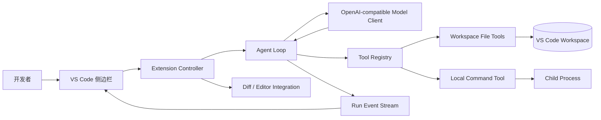
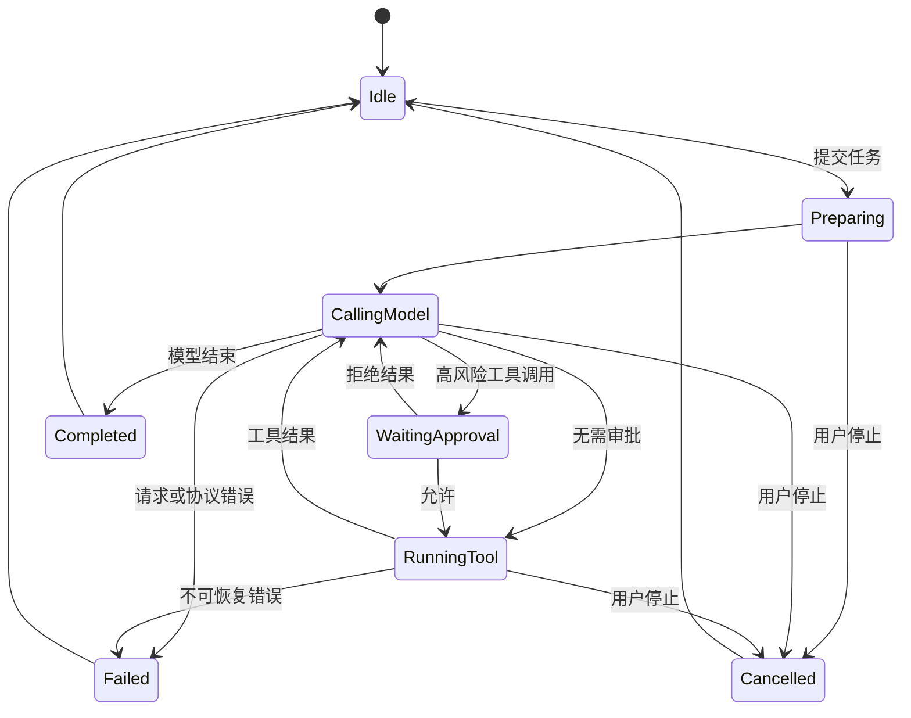

# 总体设计文档

## 1. 设计目标

系统应当让用户始终知道 agent 正在做什么、为什么需要权限、改了哪些代码以及怎样验证。实现重点放在可解释的本地 agent 闭环，而不是 IDE 基础设施或界面动画。

## 2. 总体架构



## 3. 模块职责

| 模块 | 职责 | 不负责的内容 |
| --- | --- | --- |
| AgentPanel | Webview 生命周期、输入、时间线、审批和按钮事件 | 模型协议与文件操作 |
| ExtensionController | 连接 UI、配置、密钥、agent 和 Diff | 决定模型下一步行为 |
| AgentLoop | 消息历史、工具调度、循环、取消、终止与事件 | 具体工具实现 |
| ModelClient | HTTP 请求、响应解析、tool call 规范化 | 自动执行工具 |
| ToolRegistry | 工具 schema、参数校验、调用与统一错误 | UI 渲染 |
| WorkspaceTools | 搜索、读取、修改和路径安全 | 网络请求 |
| CommandTool | 本地进程、超时、输出上限、取消 | 解释命令语义 |
| ChangeTracker | 修改前快照、变更文件、Diff 数据 | Git 提交与推送 |

## 4. Agent 循环

```text
initialize(messages, tools, limits)
for step in 1..maxSteps:
    response = model.complete(messages, tools, cancellation)
    append(response)
    if response has no tool calls:
        finish with response text
    for toolCall in response.toolCalls:
        validate arguments and permission
        result = execute locally or return structured error
        append tool result using the same toolCall id
        emit observable event
stop with max-steps reason
```

循环遵循以下原则：

- 工具调用和结果严格通过 `tool_call_id` 配对。
- 任何工具异常都被规范化为模型可理解且不会破坏协议的结果。
- 模型的普通文本不是代码执行；只有显式工具调用能改变工作区。
- 完成时记录验证证据；没有运行测试时必须明确说明。

## 5. 状态机



## 6. 工具协议

首版工具：

| 工具 | 核心参数 | 输出 | 风险等级 |
| --- | --- | --- | --- |
| `list_files` | `glob`, `limit` | 相对路径列表 | 只读 |
| `search_text` | `query`, `include`, `limit` | 文件、行号、文本 | 只读 |
| `read_file` | `path`, `startLine`, `endLine` | 带行号文本 | 只读 |
| `replace_in_file` | `path`, `oldText`, `newText` | 修改统计与文件路径 | 写入 |
| `write_file` | `path`, `content` | 创建或覆盖结果 | 写入 |
| `run_command` | `command`, `reason` | exit code、stdout、stderr、超时状态 | 执行 |

参数首先经过结构校验。路径经标准化和绝对路径解析后，必须仍位于工作区根目录。读取和命令输出均设置字符上限，并显式标注截断。

## 7. 上下文管理

上下文由四层构成：

1. 稳定系统说明：角色、工作区、工具约束、完成标准。
2. 用户任务：原始需求、活动文件、选区和显式附加文件。
3. 运行历史：模型回复、tool call 与 tool result。
4. 压缩摘要：接近上下文上限时保留目标、决策、已改文件、错误和待办。

首版使用字符和消息数预算，优先裁剪重复命令输出。任何压缩都不能丢失当前任务、未解决错误、已修改文件和审批结果。

## 8. 本地执行与安全

- 进程工作目录固定为工作区根目录。
- 命令默认需要逐次审批；只读文件工具自动执行。
- 进程使用独立取消信号和超时，停止任务时终止进程树。
- 不执行模型提供的工作区切换；不展开指向工作区外的文件路径。
- API key 由 VS Code SecretStorage 提供，不写入消息、日志或配置文件。
- UI 对命令、路径和输出进行文本转义，防止 Webview 注入。

## 9. 变更审查

ChangeTracker 在首次写入前保存文件原内容，在任务内维护变更集合。完成后 UI 展示文件名与增删摘要；用户可使用 VS Code Diff 比较任务前快照和当前内容。首版不自动执行 Git commit，以避免把模型行为扩大为外部状态变更。

## 10. 错误处理

| 错误 | 处理 |
| --- | --- |
| 模型认证或限流 | 停止当前请求，保留历史，提示检查配置或稍后重试 |
| tool call JSON 无效 | 返回结构化工具错误，允许模型修正一次 |
| 文件并发变化 | 拒绝陈旧替换，要求重新读取 |
| 命令超时 | 终止进程，返回已有输出和超时标志 |
| 输出过长 | 保存必要尾部并返回截断标记 |
| 最大步骤耗尽 | 安全结束，展示已完成内容和未完成原因 |

## 11. 可扩展点

ModelClient 与 ToolRegistry 使用接口隔离，将来可增加其他模型协议或工具，但首版不做动态插件系统、多 agent 调度和远程执行。

