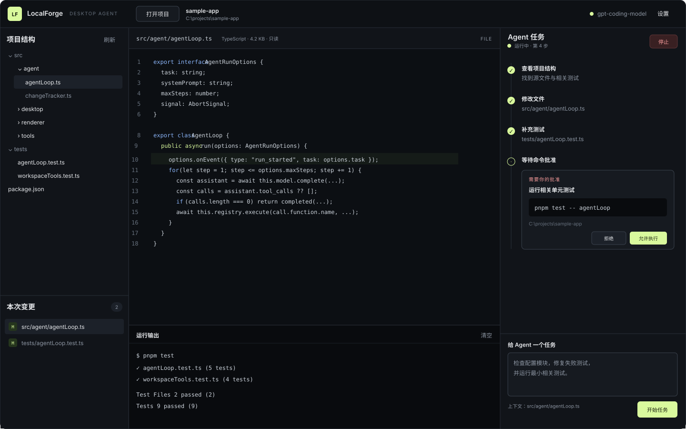

# 界面原型与交互说明

## 1. 原型

原型是一套独立桌面工作台，不嵌入 VS Code。它只展示完成 Agent 任务所需的代码结构与结果，不承担完整 IDE 的文本编辑、调试或版本控制功能。

## 2. 信息结构

### 顶部：应用与项目

- LocalForge 标识与“Desktop Agent”产品形态。
- “打开项目”、当前项目名与本地路径。
- 模型是否配置以及设置入口。

### 左侧：项目结构与变更

- 上半区显示过滤后的目录树；依赖、缓存和构建目录不出现。
- 下半区集中列出本次 Agent 修改的文件及数量。
- 文件点击进入只读预览，变更文件点击进入 Diff。

### 中间：代码与证据

- 顶部显示相对路径、语言、大小和 FILE/DIFF 模式。
- FILE 模式显示只读源码；DIFF 模式并排显示修改前与修改后。
- 底部保留运行输出，用于展示命令、stdout、stderr 和工具结果。

### 右侧：Agent 任务

- 头部显示待命、运行中、失败状态和停止按钮。
- 时间线逐步展示模型回合、读/改/测工具和耗时。
- 底部输入任务，并提示当前选中的文件上下文。

## 3. 关键状态

| 状态 | UI 表现 | 可用操作 |
| --- | --- | --- |
| 未打开项目 | 中间显示打开项目引导 | 打开项目、配置模型 |
| 项目就绪 | 左侧目录树、中间项目摘要 | 选文件、提交任务 |
| 运行中 | 状态点高亮、时间线持续追加 | 查看过程、停止 |
| 等待审批 | 模态框显示原因、命令、cwd | 允许、拒绝 |
| 修改完成 | 左侧出现变更文件 | 查看双栏 Diff、继续任务 |
| 失败/取消 | 时间线保留错误和已有结果 | 修正配置、重新提交 |

## 4. 交互规则

- 同一时刻只允许一个任务；运行期间不能切换项目。
- 文件仅供预览，所有修改必须来自可追踪的 Agent 工具调用。
- 每条本地命令都单独审批，拒绝不会伪造执行结果。
- “完成”与测试是否通过分开表达；输出面板保留真实证据。
- 停止后保留已修改文件和时间线，供用户审查。
- 所有动态文本按纯文本渲染，避免模型输出注入界面。

## 5. 原型到实现的对应关系

| 原型区域 | 实现文件 |
| --- | --- |
| 桌面窗口与顶栏 | `src/main.ts`、`src/renderer/index.html` |
| 项目结构 | `src/desktop/projectService.ts`、`src/renderer/app.ts` |
| 代码与 Diff | `src/renderer/app.ts` |
| 时间线与审批 | `src/renderer/app.ts`、`src/main.ts` |
| 视觉样式 | `src/renderer/styles.css` |

实际桌面窗口已于 2026-08-27 启动检查，三栏区域、初始状态、项目树与辅助功能文本均正常显示。
