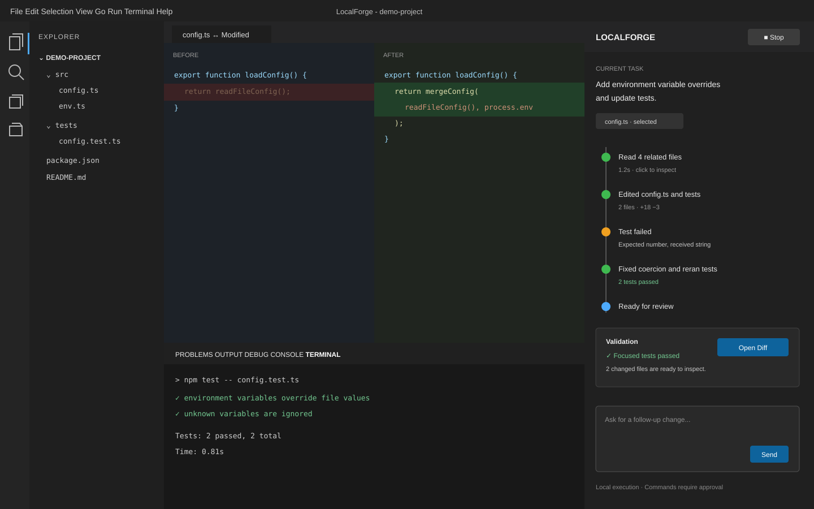

# 界面原型与交互说明

## 1. 原型

原型使用 VS Code 原生文件树、编辑器、Diff 和底部输出区域；LocalForge 只新增右侧 agent 侧边栏，从而把实现精力集中在任务交互和 agent 状态上。

## 2. 信息结构

侧边栏从上到下分为：

1. **任务头部**：运行状态、模型、停止操作。
2. **上下文条**：当前附加的文件或选区，可删除或继续添加。
3. **运行时间线**：模型说明、文件工具、命令审批、测试结果和错误。
4. **完成摘要**：验证证据、变更文件和“打开 Diff”。
5. **输入区**：新任务或针对当前结果的后续要求。

## 3. 关键状态

| 状态 | UI 表现 | 可用操作 |
| --- | --- | --- |
| 空闲 | 显示输入引导和当前上下文 | 发送任务、附加上下文 |
| 思考/请求模型 | 头部显示运行中，时间线追加状态 | 停止 |
| 执行只读工具 | 展开项显示工具、路径和耗时 | 查看结果、停止 |
| 等待命令审批 | 高亮命令、工作目录和原因 | 仅本次允许、拒绝、停止 |
| 执行命令 | 流式显示必要输出 | 停止 |
| 修改完成 | 展示变更文件和验证状态 | 打开 Diff、继续修改 |
| 失败/取消 | 保留已产生的过程和变更 | 重试、继续新要求 |

## 4. 交互规则

- Enter 发送，Shift+Enter 换行。
- 同一时刻只允许一个 agent run，避免并发写文件。
- 新文件、写文件和命令卡片默认展开；连续读取操作默认折叠。
- “完成”必须同时展示验证状态，不能只显示绿色成功文案。
- 拒绝命令不会终止对话，模型可以选择替代方案。
- 停止后保留已修改文件，用户可通过 Diff 决定下一步。

## 5. 首版与后续版本边界

首版只做一个侧边栏，不做自定义文件树、完整聊天历史管理、多任务列表、内置终端模拟器或云端任务。这些能力不会影响核心闭环的评审和演示。

