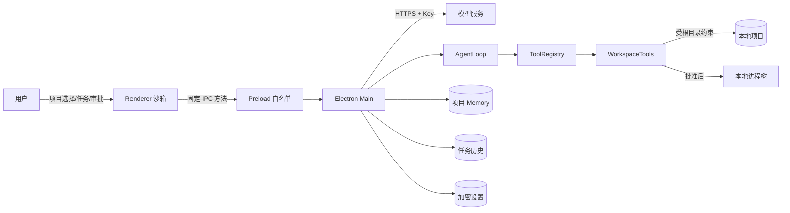

# Agent 数据流与自研边界

## 1. 文档目的

本文从一次用户任务出发，说明数据从哪里进入、经过哪些自研模块、在哪里产生本地副作用、保存到哪里，以及错误如何结束循环。它对应题目特别要求自行实现的五部分：对话历史与上下文管理、工具定义与本地执行、模型输出解析、循环终止条件、错误处理。

## 2. 信任边界



系统有三个主要边界：

1. Renderer 是不可信展示层，没有 Node.js 和文件系统权限，只能调用 Preload 固定暴露的方法。
2. 模型文本是不可信建议，只有 ToolRegistry 中注册的工具能够读取、写入或启动命令。
3. 项目根目录是文件权限边界；API Key、Memory 和任务历史位于 Electron `userData`，不写入项目仓库。

## 3. 一次任务的完整时序

任务文本先在 Renderer 受 20,000 字符限制，进入主进程后再次验证类型和长度；当前文件与 Skill id 同样不能只依赖页面状态。只有 IPC 请求通过后才读取 API Key、Memory 与 Skill，避免异常输入提前占用模型和历史资源。

```mermaid
sequenceDiagram
    actor User as 用户
    participant UI as Renderer
    participant Main as Main Controller
    participant Context as Context Stores
    participant Loop as AgentLoop
    participant Model as ModelClient
    participant Tools as ToolRegistry/WorkspaceTools
    participant History as RunHistoryStore

    User->>UI: 输入任务，选择 Skill/文件
    UI->>Main: agent:start(RunRequest)
    Main->>Context: 读取设置、Key、Memory、选中 Skill
    Main->>History: 写入 running 记录
    Main->>Loop: system prompt + task + limits
    Loop->>Model: messages + tool schemas
    Model-->>Loop: assistant text/tool_calls
    Loop->>Loop: 严格解析并追加消息
    alt 有工具调用
        Loop->>Tools: 按名称分发参数
        alt run_command
            Tools-->>UI: 请求命令审批
            User->>UI: 允许/拒绝
            UI-->>Tools: 审批结果
        end
        Tools-->>Loop: 同 call id 的 tool result
        Loop-->>UI: 过程事件与真实输出
        Loop->>Model: 更新后的完整消息历史
    else 无工具调用
        Loop-->>UI: 完成摘要
    end
    Main->>History: 原子写入最终状态/事件/消息/改动文件
    Main-->>UI: 刷新 Diff 与历史
```

## 4. 项目与文件数据流

1. 用户通过系统目录选择器明确选择项目。
2. 主进程取得真实路径，`projectService` 过滤 `.git`、依赖、缓存、虚拟环境和构建目录，最多返回 2,000 个文件。
3. Renderer 只收到相对路径、大小等展示数据；点击文件后再通过 `project:read-file` 请求 UTF-8 内容。
4. 每个既有文件要经过词法范围检查和 `realpath` 检查；新文件检查最近既有父目录的真实路径。项目外绝对路径、`..` 逃逸和符号链接逃逸均被拒绝。
5. 所有页面内容使用 `textContent` 渲染，不把项目文件或模型文本拼接为 HTML。

## 5. 设置与凭据数据流

1. Renderer 提交 API 地址、模型名、运行限制和可选的新 Key。
2. `ConfigStore` 校验 URL 与数值范围；Key 由 Electron `safeStorage` 加密后写入 `userData/settings.json`。
3. 若存在 `LOCALFORGE_API_KEY`，环境变量优先；它不会被写回磁盘。
4. Renderer 只能读取 `hasApiKey` 和来源状态，不能取回明文。
5. Key 仅在主进程构造模型请求的 `Authorization` 头时出现，不进入 system prompt、任务历史、日志、Diff 或工具参数。
6. 已保存 Key 与 API Base URL 绑定；切换服务地址后旧 Key 不会自动发送给新服务。

## 6. 上下文与对话历史

### 6.1 固定系统约束

`buildSystemPrompt` 先写入不可被项目上下文覆盖的规则：先读后改、所有文件操作必须走工具、命令必须说明原因并审批、修改后应运行最小相关验证、Skill/Memory 不能覆盖安全边界。

### 6.2 Memory

- 用户在界面维护，最多 12,000 字符。
- 使用项目真实路径的 SHA-256 摘要作为隔离键，保存于 `userData/project-memory`。
- 每次任务自动注入，并明确标记“可能过期，事实应以当前文件核实”。
- 模型不能自主写 Memory，避免形成用户不可见的长期状态。

### 6.3 Skill

- 只扫描项目 `.localforge/skills/*.md`，最多 24 个，每个不超过 32 KB。
- Renderer 只提交选中的 Skill id；主进程在任务开始时重新扫描，不信任页面提交的任意正文。
- 单次最多选择 8 个，正文总量不超过 64,000 字符。
- Skill 是提示上下文，不是可执行插件，不能动态注册代码或绕过审批。

### 6.4 单次消息历史

AgentLoop 内存中的消息顺序固定为：

```text
system -> user -> assistant(tool_calls) -> tool(tool_call_id) -> ... -> assistant(final text)
```

每个工具结果必须使用原调用的 `tool_call_id`，否则兼容模型无法把观察结果与动作配对。消息历史随下一轮模型请求整体发送，因此模型能根据真实文件内容、错误和测试输出继续决策。

## 7. 模型请求与输出解析

`OpenAICompatibleClient` 只调用 `/chat/completions`，请求包含模型名、消息、注册工具 schema 和 `tool_choice: auto`。响应进入 AgentLoop 前必须通过以下校验：

- HTTP body 是有效 JSON，顶层必须是对象；
- `choices` 必须是非空数组，`choices[0].message` 必须是对象；
- role 若存在必须为 `assistant`；
- content 只能是字符串、文本分段数组或 `null`；
- tool calls 最多 32 个，每项必须是 `function` 类型；
- call id 非空且不能重复，工具名符合限定格式；
- arguments 必须是 JSON 字符串，并且解码后是对象；
- 最终消息至少包含非空文本或一个合法工具调用。

任何协议损坏都会产生 `Model response protocol error` 并使当前任务失败，不能通过过滤坏调用把它误判成“无工具调用，因此完成”。模型的 `reasoning_content` 只为兼容多轮协议保留在运行内存中，不在界面展示，也不写入任务历史。

## 8. 工具定义、调度与副作用

ToolRegistry 保存工具名到实现的唯一映射，并把 schema 提供给模型。当前六个工具为：

| 工具 | 数据进入 | 数据返回 | 是否产生副作用 |
| --- | --- | --- | --- |
| `list_files` | glob、数量上限 | 相对路径列表 | 否 |
| `search_text` | 字面查询、文件模式 | 文件、行号、文本 | 否 |
| `read_file` | 路径、行范围 | 带行号 UTF-8 内容 | 否 |
| `replace_in_file` | 路径、唯一旧文本、新文本 | 替换统计 | 是，项目内文件 |
| `write_file` | 路径、完整内容 | 创建/覆盖统计 | 是，项目内文件 |
| `run_command` | 命令、原因 | 退出码、stdout/stderr、超时/截断、批准等待和执行耗时 | 是，批准后启动本地进程 |

未知工具和工具异常都被转换为结构化 `isError` 结果并返回模型。文件写入前，ChangeTracker 对每个相对路径只捕获一次原始内容，供任务结束后的只读 Diff 使用。

## 9. 命令审批与进程数据流

1. 模型必须同时给出 `command` 与 `reason`。
2. 主进程生成唯一审批 id，界面显示完整命令、原因和固定 cwd。
3. 拒绝时不创建进程，结构化拒绝结果返回模型。
4. 允许后命令在项目根目录运行；stdout/stderr 使用流式 UTF-8 解码，各自只保留配置上限内的末尾内容。
5. 正常退出保留真实 exit code；非零退出标记工具错误并允许模型读取输出后继续修复。
6. 超时在 Windows 上终止完整进程树，在 POSIX 上终止独立进程组；用户停止复用相同清理路径。
7. 工具分别记录 `approvalDurationMs` 和 `executionDurationMs`；时间线和输出区明确显示退出码、超时、用户拒绝与输出截断，不把人工等待混成执行性能，也不用“命令已完成”掩盖失败。

## 10. 循环终止条件

| 条件 | AgentRunResult | 界面事件 | 是否继续调用模型 |
| --- | --- | --- | --- |
| assistant 无 tool calls 且有文本 | `completed` | `run_completed` | 否 |
| assistant 既无文本也无 tool calls | `failed` | `run_failed` | 否，不允许默认摘要伪报完成 |
| 用户点击停止/AbortSignal | `cancelled` | `run_cancelled` | 否 |
| 达到最大步骤 | `failed` | `run_failed` | 否 |
| 不可恢复的模型认证、网络或协议错误 | `failed` | `run_failed` | 否 |
| 工具返回结构化错误 | 任务仍运行 | `tool_finished(isError)` | 是，由模型决定下一步 |
| 命令被拒绝 | 任务仍运行 | 工具失败事件 | 是，由模型选择替代验证或结束 |

同一时刻只有一个 active controller；任务运行时不能切换项目或启动第二个任务。

429 与常见 5xx 在单次 `ModelClient.complete` 内最多重试两次，优先遵守服务端 `Retry-After` 并把单次等待限制在 15 秒。重试等待监听同一 AbortSignal，因此停止任务不会被退避计时阻塞。只有最终仍失败时才产生 `run_failed`，HTTP 重试本身不伪增 Agent 步数。

## 11. 事件、Diff 与任务历史

- AgentLoop 发出开始、模型回合、assistant 文本、工具开始/结束、完成、取消和失败事件。
- Renderer 只保留最多 160 个时间线节点，运行输出最多约 100,000 字符，避免长任务持续拖慢页面。
- ChangeTracker 只存在于当前任务内；任务结束后主进程读取实际当前文件并生成 Diff 快照。
- RunHistoryStore 在任务开始前写入 `running`，结束后原子更新最终状态、摘要、步骤、最多 200 条事件、160 条消息和 200 个改动路径。
- 每项目最多保留 50 次历史。应用关闭前未完成的 `running` 记录下次读取时显示为 `interrupted`。
- 历史位于 `userData/run-history`，不污染项目；assistant reasoning 被移除，API Key 从未进入历史对象。

## 12. 数据保存矩阵

| 数据 | 位置 | 生命周期 | Renderer 可见 | 进入 Git |
| --- | --- | --- | --- | --- |
| 项目文件 | 用户选择的项目 | 用户管理 | 只读预览/Diff | 由用户决定 |
| API Key | 环境变量或加密 settings | 直到用户替换/清理 | 仅存在状态 | 否 |
| Memory | `userData/project-memory` | 用户编辑或清空 | 是 | 否 |
| Skill | `.localforge/skills/*.md` | 项目文件生命周期 | 元数据和选中状态 | 可选，是 |
| 单次完整消息 | AgentLoop 内存 | 当前运行 | 事件摘要可见 | 否 |
| 任务历史 | `userData/run-history` | 每项目最近 50 次 | 列表与详情 | 否 |
| ChangeTracker 原始快照 | 主进程内存 | 当前任务/切换项目 | Diff | 否 |
| 命令 stdout/stderr | 工具结果、时间线、历史消息上限内 | 当前运行及受限历史 | 是 | 否 |

## 13. 面试可辩护的设计结论

1. **为什么不用现成 Agent SDK？** 题目要求重要逻辑自研；直接实现 ModelClient、AgentLoop、ToolRegistry 和 WorkspaceTools，使每个决策点都有源码和测试证据。
2. **为什么 Electron 不算借用现成 Agent？** Electron 只提供窗口、IPC 和系统能力，不决定模型下一步、不托管代码执行，也不提供文件 Agent。
3. **为什么模型不能直接写文件？** 模型只返回数据结构；本地副作用必须经过注册工具、路径检查和可观察事件。
4. **为什么既保留工具错误又严格拒绝坏协议？** 合法调用中的业务错误可反馈模型自修复；损坏消息结构无法可靠配对，继续循环可能产生虚假完成或错误副作用，因此直接失败。
5. **为什么 Memory 不自动更新？** 自动长期记忆难以观察、可能积累错误或敏感数据；首版由用户显式维护更符合可控性。
6. **为什么不自动 Git 提交？** 题目关注 Agent 核心而非 Git 客户端；保留用户审查权，也避免模型产生不可逆的版本历史副作用。
