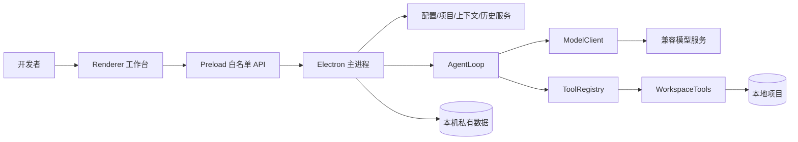

# 项目中期基线与软件生命周期管理

## 1. 文档信息

| 项目 | 内容 |
| --- | --- |
| 项目名称 | LocalForge 本地编程智能体桌面应用 |
| 文档版本 | 1.0 |
| 基线日期 | 2026-08-28 |
| 最终截止 | 2026-09-02 24:00（北京时间） |
| 内部冻结 | 2026-09-02 20:00 |
| 生命周期模型 | 裁剪瀑布模型，阶段内允许受控验证反馈 |
| 当前阶段 | 设计基线完成，核心实现完成，进入系统验证与交付准备 |

本文是项目中期评审的总入口，用来回答五个问题：项目为什么做、按什么过程做、当前做到哪里、质量如何证明、截止前还准备做什么。详细需求、用例、架构、测试和风险仍由原专题文档维护，本文只建立统一基线、阶段门禁和交付口径。

## 2. 中期状态摘要

截至基线日期，项目已经从早期 VS Code 扩展设想调整为独立 Electron 桌面应用。Electron 只承担窗口、Renderer 沙箱、Preload 白名单和系统对话框；模型请求、多轮 AgentLoop、工具协议、本地文件操作、命令审批、停止条件和错误处理均由仓库代码实现。

### 2.1 已完成基线

- 18 项功能需求和 9 项非功能需求已有编号、验收标准和追踪关系。
- 12 个用户用例覆盖打开项目、读改测、命令审批、模型配置、Skill、Memory、历史、附件和异常响应。
- 独立三栏工作台、连续会话、流式输出、Diff、历史、Skill/Memory CRUD、模型/权限/响应档位和 Token 展示已经实现。
- 模型协议支持 OpenAI-compatible `/chat/completions`、SSE 文本与工具分片、完整 JSON 回退、usage 解析和严格错误校验。
- 本地工具具备项目路径边界、1 MB 单文件限制、命令逐次审批、超时、取消、Windows 进程树清理和敏感环境变量隔离。
- 23 个测试文件、112 项自动化测试通过；类型检查、构建和交付检查通过。
- ModelScope 真实模型完成三轮修改闭环，演示项目均由 2/6 达到 6/6，外部独立复核仍为 6/6；另有一轮只读验证保持 0 命令、0 改动。

### 2.2 当前尚未完成

- GitHub Actions 远端流水线尚未建立；当前只有本地 `verify` 和 `verify:delivery` 门禁。
- 最终视频尚未计时彩排和录制。
- 可分发安装包尚未制作；题目若只要求源码、视频和说明，可将安装包降级为非阻塞项。
- Renderer 复杂状态主要依靠主进程/存储测试和桌面人工检查，尚无完整 DOM/Electron 自动化回归。
- 上次项目自动恢复、按项目草稿、文件快速打开、代码行号/复制和步骤耗尽后的继续入口已作为一次经用户批准的 P1 体验包完成；历史分组未进入本次范围。

“已完成”只表示存在源码和当前证据；“尚未完成”不能通过文档表述替代实际实现或验收。

## 3. 生命周期模型与阶段门禁

### 3.1 模型选择

项目采用面向短周期单人项目的裁剪瀑布模型：需求、设计、实现、验证、交付按基线顺序推进，每个阶段设置进入条件、退出条件和交付物。阶段内部允许使用原型和测试反馈修正本阶段内容，但架构或需求基线变化必须经过变更评估，不能无记录地反复扩张范围。

早期为降低技术风险，项目先做过 AgentLoop 和 VS Code 形态原型，这属于瀑布正式基线前的可行性验证。08-27 改为独立桌面应用是一次已经记录的架构变更，不伪装成最初计划完全未变。中期基线之后，新增功能必须服从截止时间和质量门禁。

### 3.2 阶段计划

| 阶段 | 时间 | 进入条件 | 主要活动与交付物 | 退出条件 | 状态 |
| --- | --- | --- | --- | --- | --- |
| 可行性与立项 | 08-27 | 获得考核题目 | 技术边界分析、形态比较、风险初识、仓库初始化 | 明确自研 Agent 边界和独立桌面方向 | 已完成 |
| 需求分析 | 08-27 | 产品目标明确 | PRD、非功能需求、12 个用例、成功标准、追踪编号 | FR/NFR 可测试，范围内外清晰 | 已完成并基线化 |
| 总体与详细设计 | 08-27—08-28 | 需求基线可用 | 架构、进程边界、数据流、状态机、工具协议、原型、ADR | 核心模块职责和安全边界可从源码映射 | 已完成并基线化 |
| 编码与单元验证 | 08-27—08-30 | 设计接口明确 | Agent、模型客户端、工具、桌面服务、Renderer、单元和集成测试 | P0 功能闭环，类型检查和相关测试通过 | 核心完成，补充项执行中 |
| 系统与验收测试 | 08-30—09-01 | 候选构建可启动 | 全量回归、真实模型重复验证、桌面检查、干净克隆、缺陷复测 | 无已知阻塞缺陷，核心演示连续稳定 | 进行中 |
| 发布与交付 | 09-01—09-02 | 候选版本通过门禁 | 视频彩排、凭据扫描、README.txt、最终推送、压缩包复核 | 材料格式正确，20:00 前冻结远端 | 待执行 |
| 维护与复盘 | 交付后仅本地 | 已完成提交 | 缺陷复盘、架构债务和后续路线记录 | 不违反截止后禁止推送约束 | 计划项 |

### 3.3 阶段评审和变更控制

每个阶段结束执行一次轻量评审：检查输入是否完整、交付物是否存在、风险是否更新、测试证据是否支持完成结论。需求或架构变更按以下流程处理：

1. 记录变更原因、影响需求和期望收益。
2. 评估源码、测试、文档、视频和截止时间影响。
3. 标记 P0/P1/P2；不能提升核心闭环可信度的功能默认不进入当前版本。
4. 架构级变更新增 ADR；普通功能同步更新 PRD、用例、设计、测试和追踪矩阵。
5. 通过相关测试和完整门禁后才算变更关闭。

## 4. 需求与用例基线

### 4.1 需求分层

| 层级 | 内容 | 基线 |
| --- | --- | --- |
| 产品目标 | 在用户明确打开的本地项目中完成可观察、可控制的 coding agent 闭环 | 不变 |
| P0 功能 | 项目读取、任务提交、工具循环、文件读改、命令审批、停止条件、过程和 Diff、模型配置、连续会话、严格协议 | 冻结，只修缺陷 |
| P1 功能 | Skill、Memory、附件、权限/模型/响应档位、Token、上下文管理体验 | 核心已实现，可做低风险完善 |
| P2/范围外 | 多 Agent、多人协作、完整 IDE、调试器、Git 客户端、云端执行、自动长期记忆 | 本次不做 |

功能需求的权威清单见 [01-product-requirements.md](01-product-requirements.md)，实现和证据映射见 [08-traceability.md](08-traceability.md)。

### 4.2 用例组合与验收重点

| 用例组 | 用例 | 主要验收点 | 证据类型 |
| --- | --- | --- | --- |
| 项目理解 | UC-01、UC-03 | 项目树完整、文件只读预览、路径不越界 | 项目服务测试、桌面检查 |
| 编程闭环 | UC-02、UC-04、UC-05 | 读—改—测、失败结果回传、Diff 可审查 | Agent/工具测试、真实模型记录 |
| 安全控制 | UC-06、UC-07、UC-11 | 命令逐次审批、Key 隔离、坏协议明确失败 | IPC/配置/模型协议测试 |
| 上下文管理 | UC-08、UC-09、UC-12 | Skill、Memory、附件只有显式选择才进入上下文 | 存储、Prompt、TaskContext 测试 |
| 会话管理 | UC-10、UC-12 | 连续追问、新会话、历史切换、整段删除 | 历史存储和桌面检查 |

用例不能只写正常流程。路径越界、API Key 缺失、模型空回复、重复坏工具调用、命令拒绝、超时、取消和步骤耗尽均作为异常或替代流程保留。

## 5. 软件架构设计基线

### 5.1 架构视图



### 5.2 分层职责

| 层 | 负责 | 不负责 |
| --- | --- | --- |
| Renderer | 项目树、代码/Diff、会话、设置、审批和状态展示 | 读取 Key、任意 IPC、直接文件或命令访问 |
| Preload | 将固定类型化方法映射到固定 IPC 通道 | 暴露通用 `send/invoke` 或 Node 能力 |
| 主进程服务 | 项目状态、参数校验、凭据、历史、上下文和 Agent 编排 | 替模型作出工具决策 |
| Agent 核心 | 消息历史、模型回合、工具调度、终止和错误传播 | 依赖 Electron 或直接访问 UI |
| 工具层 | 项目内读、搜、改、写和批准后命令执行 | 绕过项目根、审批、大小和超时限制 |
| 模型适配层 | HTTP/SSE、协议聚合、usage 和错误分类 | 执行本地副作用 |

详细架构、状态机和错误表见 [03-system-design.md](03-system-design.md)，完整数据流见 [11-agent-data-flow.md](11-agent-data-flow.md)。

### 5.3 关键质量场景

| 场景 | 响应要求 | 设计措施 |
| --- | --- | --- |
| Renderer 被不可信输入影响 | 不获得系统或文件权限 | sandbox、contextIsolation、Preload 白名单、安全 Markdown |
| 模型请求项目外路径 | 不读取、不写入 | 词法路径和 realpath 双重边界、符号链接处理 |
| 模型反复提交坏调用 | 不耗尽所有步骤 | 结构化工具错误、连续三次同错熔断 |
| 命令被拒绝或超时 | 不伪造成功、不留进程树 | 未批准不启动；超时/取消清理完整进程树 |
| 服务返回损坏流 | 不执行半截工具调用 | SSE 聚合完成后严格校验 id、名称和对象参数 |
| 应用异常退出 | 历史不显示虚假运行中 | 遗留 `running` 读取为 `interrupted` |

### 5.4 架构决策与技术债务

- ADR-0001 保留 VS Code 扩展初始方案，ADR-0002 记录切换到独立 Electron 的原因。
- 当前不引入 Agent SDK，便于证明循环、工具和停止逻辑自研。
- 当前没有远端服务端、账号系统和多人数据同步，部署边界保持单机。
- Renderer 自动化、安装包和 Diff 外部冲突检测属于已知技术债务；它们必须进入计划或明确延期，不能在答辩中声称已经完成。

## 6. 工作分解与剩余工作量估算

### 6.1 估算方法和假设

剩余工作使用三点估算：乐观值 O、最可能值 M、悲观值 P，期望工时 `E = (O + 4M + P) / 6`。单位为单人有效开发小时，不包括模型服务限流造成的不可控等待。已经完成但没有可靠计时的数据只记录状态，不反推“实际工时”。

估算假设如下：

- 1 名主要开发者，08-28 至 09-01 每天约 6 小时有效开发时间，09-02 主要用于冻结和上传。
- 现有架构不重写，不新增服务端、数据库、完整编辑器或 Git 客户端。
- P0 交付优先，P1 体验项只能在质量门禁稳定后进入。
- 远端免费模型可能限流，因此真实模型彩排要预留重试窗口，但不能无限重试。

### 6.2 剩余 WBS 与三点估算

| WBS | 工作包 | 优先级 | O | M | P | E | 状态/退出条件 |
| --- | --- | --- | ---: | ---: | ---: | ---: | --- |
| W1 | 中期生命周期基线和专题文档补齐 | P0 | 2 | 3 | 5 | 3.2 | 本文、索引、计划/质量/测试口径一致 |
| W2 | 建立 GitHub Actions 质量流水线 | P0 | 2 | 3 | 6 | 3.3 | 干净环境安装、verify、交付检查通过 |
| W3 | 自动恢复上次项目和任务草稿 | P1 | 2 | 3 | 5 | 3.2 | **已完成**：桌面重启恢复，失效路径自动清除 |
| W4 | Ctrl+P、代码行号和复制操作 | P1 | 4 | 6 | 9 | 6.2 | **已完成**：键盘搜索/打开和只读预览验收通过 |
| W5 | 步骤耗尽中文恢复和历史会话分组 | P1 | 3 | 5 | 8 | 5.2 | **部分完成**：耗尽恢复完成；历史分组延期且未伪报完成 |
| W6 | 测试补齐、桌面回归和干净克隆复验 | P0 | 4 | 6 | 10 | 6.3 | 自动化门禁通过，人工矩阵有记录 |
| W7 | 视频彩排、录制、README.txt 和最终材料 | P0 | 4 | 6 | 10 | 6.3 | 两分钟/200 MB/无隐私，材料可重新打开 |
| W8 | 缺陷修复与远端服务不确定性缓冲 | P0 | 3 | 5 | 10 | 5.5 | 只用于已发现缺陷和交付风险 |
|  | **合计** |  | **24** | **37** | **63** | **39.2** |  |

该估算在批准变更前表明：P0 期望工时约 24.6 小时，全部候选同时进入会把期望工时提高到 39.2 小时。2026-08-28 用户明确批准将 W3、W4 与 W5 中的“步骤耗尽恢复”合并实施；实际变更沿用现有架构并已通过全量门禁。W5 的历史分组和其他未列体验仍延期，防止已批准的例外继续扩张。

### 6.3 中期后排期

| 日期 | 计划 | 质量检查点 |
| --- | --- | --- |
| 08-28 | 生命周期基线、流水线设计、P0 缺口审计 | 文档评审、链接检查、范围冻结 |
| 08-29 | 对已完成 P1 体验包做回归，不再新增体验范围 | 相关测试与完整 verify 持续通过 |
| 08-30 | 系统回归、真实模型和错误路径复验 | 无阻塞缺陷，失败均有可解释状态 |
| 08-31 | 候选版本、干净克隆和桌面检查 | 候选构建可启动，核心用例连续通过 |
| 09-01 | 视频计时彩排、材料预检查 | 关键证据在两分钟内可见，无隐私 |
| 09-02 | 全量门禁、录制、最终推送、压缩和复核 | 20:00 冻结，上传后重新下载检查 |

## 7. 开发过程与软件开发效能

### 7.1 开发工作流

一个变更按以下状态流转：

```text
需求/缺陷 -> 影响分析 -> 设计与测试点 -> 实现 -> 相关测试
-> 全量 verify -> 文档/追踪更新 -> 桌面检查 -> 提交/推送
```

单人项目仍进行角色逻辑分离：需求确认时站在产品视角，编码前写验收点，完成后用测试视角检查失败路径，发布前再用交付视角检查凭据、视频和压缩包。不能用“开发者自测过”替代可复现证据。

### 7.2 Definition of Ready

进入编码前至少满足：

- 用户价值和不做范围明确。
- 对应 FR/UC 或缺陷编号已确定。
- 影响模块、数据边界和权限变化已分析。
- 至少写出正常路径、失败路径和验收方法。
- 估算可在冻结时间前完成并回归；否则降级或延期。

### 7.3 Definition of Done

完成一个工作包必须满足：

- 代码、界面或文档达到验收标准，没有占位按钮。
- 不可信输入在主进程或核心边界重新验证。
- 新逻辑有相称的自动化测试；视觉逻辑有桌面检查记录。
- `pnpm run verify` 通过，发布相关变更还要通过 `verify:delivery`。
- PRD、用例、设计、测试、追踪和开发日志按影响同步。
- 明确说明未验证内容，不以默认摘要、估算 Token 或模型陈述伪装成精确事实。

### 7.4 效能指标

| 指标 | 当前可用基线 | 截止前目标 | 使用方式 |
| --- | --- | --- | --- |
| 自动化测试反馈 | 112 项测试，最新 Vitest 运行约 3.2 秒 | 日常保持在分钟级 | 发现反馈变慢时拆分慢测试，不删关键失败路径 |
| 类型/构建门禁 | 当前通过 | 每个候选版本 100% 通过 | 失败不得推送为候选版本 |
| 需求追踪覆盖 | 23/23 个 FR 有实现/测试/演示映射 | 基线变更同步率 100% | 这是追踪覆盖，不等于代码覆盖率 |
| 在制品 WIP | 单人开发 | 同时最多 1 个功能工作包 | 减少半成品和跨模块上下文切换 |
| 变更失败率 | 尚未形成稳定统计 | 逐次记录失败门禁和返工原因 | 不编造百分比，最终复盘再计算 |
| 缺陷修复周期 | 开发日志可追溯，但无统一时间戳 | P0 当日闭环，P1 冻结前决定修复/延期 | 用发现—复现—修复—复测状态记录 |
| 真实演示稳定性 | 三轮修改闭环成功，一次远端 429 失败 | 录制前连续三次核心路径可完成 | 区分产品缺陷与外部服务可用性 |

效能优化不等于追求提交数量。项目不伪造日期、不制造空提交，也不以缩短开发时间为理由跳过验证；优先缩短反馈时间、限制 WIP 和减少返工。

## 8. 软件质量管理计划

### 8.1 质量方针

LocalForge 的质量定义为：真实、可控、可观察、可复现。模型说“完成”不是质量证据；本地文件、真实退出码、测试结果、历史记录和 Diff 才是。安全边界和失败行为与正常功能同等重要。

### 8.2 质量目标和门禁

| 质量维度 | 目标 | 门禁/证据 |
| --- | --- | --- |
| 功能正确性 | P0 正常/关键异常流程可复现 | 自动化测试、真实模型、演示用例 |
| 安全性 | 无项目外读写、无 Key 入库/入历史、命令必须批准 | 路径/配置/命令环境测试、凭据扫描 |
| 可靠性 | 取消、超时、限流、坏协议、步骤耗尽均确定结束 | AgentLoop、ModelClient、进程树测试 |
| 可观察性 | 用户能看到任务、工具、结果、耗时、退出码和 Diff | AgentEvent、历史、桌面检查 |
| 可维护性 | 核心与 Electron 解耦，IPC 和契约集中 | TypeScript 类型检查、模块评审 |
| 性能 | 大项目不截断文件清单，界面按展开渲染，输出有界 | 2,000+ 文件测试、上下文/输出限制 |
| 交付合规 | 仓库、视频、README.txt 和压缩包符合题目 | `verify:delivery` 与人工复核 |

### 8.3 质量保证活动

- **需求评审**：检查每项需求是否可测试、是否超出题目范围。
- **设计评审**：检查 Renderer/主进程/Agent/工具的信任边界和依赖方向。
- **代码自检**：重点审查路径、IPC、密钥、进程和持久化变更。
- **测试评审**：关键失败路径必须存在；不追求没有业务意义的覆盖率数字。
- **候选版本评审**：完整 verify、交付检查、桌面启动、干净克隆和真实模型证据。
- **发布评审**：视频不泄露 Key/用户名，材料可打开，远端提交时间符合要求。

### 8.4 缺陷管理

| 等级 | 定义 | 处理策略 |
| --- | --- | --- |
| Blocker | 无法启动、核心任务不能执行、数据/凭据高风险 | 停止发布，立即修复和全量回归 |
| P0 | 核心闭环错误、越权、虚假成功、不可停止 | 冻结其他功能，当日闭环 |
| P1 | 主要功能可绕行但明显影响演示或理解 | 候选版本前修复或明确降级 |
| P2 | 轻微视觉、文案或低频体验问题 | 评估风险后修复或进入路线图 |

缺陷状态采用“发现—可复现—已定位—已修复—已复测—关闭/延期”。延期必须说明影响和替代方案。开发日志保留真实问题，例如流式 role、tool call id、重复坏调用、附件误判、0 Token 占位和远端 429，不能只记录成功结果。

## 9. 构建、验证与交付流水线

### 9.1 当前本地流水线

| 阶段 | 命令 | 作用 | 失败处理 |
| --- | --- | --- | --- |
| 安装 | `pnpm install --frozen-lockfile` | 按锁文件恢复依赖 | 不更新锁文件后继续 |
| 静态检查 | `pnpm run check` | TypeScript 无类型错误 | 修复后重跑 |
| 自动化测试 | `pnpm test` | 运行 23 个测试文件、112 项测试 | 定位首个根因，不跳过失败测试 |
| 构建 | `pnpm run build` | 生成主进程、Preload 和 Renderer 开发构建 | 不进入桌面验收 |
| 综合门禁 | `pnpm run verify` | 串联检查、测试、构建 | 不提交候选版本 |
| 交付门禁 | `pnpm run verify:delivery` | README.txt、禁入文件、凭据形态、文档链接、演示基线 | 不打包、不冻结 |
| 打包材料 | `pnpm run package:delivery` | 生成规定结构的交付压缩包 | 人工复核视频时长、播放和内容 |

### 9.2 计划中的 GitHub Actions

当前仓库没有 `.github/workflows`，因此远端 CI 状态为“计划中”，不能写成已完成。建议在冻结前增加一个 Windows 工作流：

1. `pull_request` 和推送到 `main` 时触发。
2. 使用 `windows-latest`、Node 22 和项目锁定的 pnpm 11.19.0。
3. 执行 `pnpm install --frozen-lockfile`。
4. 执行 `pnpm run verify`。
5. 执行 `pnpm run verify:delivery`。
6. 不向流水线注入 ModelScope Token，不在 CI 调用不稳定的免费模型。
7. 真实模型验证保留为人工、可审计但非确定性验收，不作为每次提交的自动门禁。

### 9.3 流水线设计原则

- 本地和远端使用同一包管理器、锁文件和脚本，避免“CI 专用逻辑”。
- 确定性测试进入自动流水线；依赖配额、网络和人工审批的测试单独记录。
- 不上传含 Key、用户数据、历史或构建缓存的产物。
- 只有完整流水线通过的提交才可标记候选版本；最终仍需要桌面和视频人工验收。

## 10. 测试完善计划

### 10.1 测试层次

| 层次 | 当前内容 | 中期后补强 |
| --- | --- | --- |
| 单元 | AgentLoop、协议、Prompt、Markdown、权限、配置、路径和工具参数 | 为新增体验逻辑补纯函数和状态测试 |
| 组件/存储 | ProjectContextStore、RunHistoryStore、ProjectService | 补损坏索引、并发/原子写失败等高价值边界 |
| IPC 集成 | Preload 固定映射、主进程入参校验 | 新 IPC 必须同时修改 contract、handler、preload 和测试 |
| 临时工作区 | 文件读搜改写、命令退出/拒绝/超时/取消、敏感环境隔离 | 保持 Windows 子进程树测试稳定 |
| 桌面系统 | 启动、项目树、分栏、弹窗、历史、Skill/Memory | 固化人工烟雾矩阵；不在冻结前强行引入重型框架 |
| 真实模型验收 | 三轮修改、一轮只读、429 失败记录 | 录制前用最终配置连续彩排，区分外部故障 |
| 交付验收 | README、凭据、禁入文件、演示基线 | 增加最终视频和压缩包人工复核记录 |

### 10.2 重点缺口

1. Renderer 状态多、DOM 测试少：优先抽取可测试的会话分组、快速过滤和状态转换纯函数；桌面布局保留人工验收。
2. 当前无远端 CI：先建立确定性质量流水线，再讨论覆盖率服务或复杂矩阵。
3. ModelScope 非确定性：不把远端限流当作单元测试失败，也不能因成功三次就声称服务始终稳定。
4. Diff 外部并发修改尚未检测：若本次不实现，演示项目必须保持独占，风险继续登记。
5. 打包启动尚未验证：若最终交付包含安装包，必须在无开发依赖环境重新运行；否则明确只承诺源码运行。

### 10.3 系统验收矩阵

| 编号 | 验收场景 | 预期 | 方式 |
| --- | --- | --- | --- |
| A-01 | 新克隆安装、verify、启动 | 无缺失文件，窗口可打开 | 自动 + 人工 |
| A-02 | 只读解释任务 | 只暴露读工具，0 文件改动 | 真实模型 |
| A-03 | 修改演示缺陷 | 首测失败后修复到 6/6，Diff 仅含目标文件 | 真实模型 + 外部复核 |
| A-04 | 拒绝命令 | 不创建进程，拒绝进入时间线 | 人工 |
| A-05 | 停止/超时 | 任务确定结束，无遗留子进程 | 自动 + 人工 |
| A-06 | 坏模型协议 | 明确失败，不执行半截工具调用 | 自动 |
| A-07 | Skill/Memory/会话 CRUD | 创建、编辑、选择、二次确认删除并同步状态 | 自动 + 桌面 |
| A-08 | 凭据与交付扫描 | Key、环境文件、PDF/视频/zip 不误入 Git | 脚本 + 人工 |
| A-09 | 视频材料 | 小于两分钟和 200 MB，无用户名/Key | 人工，工具可辅助 |

详细 35 个核心测试场景见 [06-test-plan.md](06-test-plan.md)。

## 11. 配置、发布与文档管理

### 11.1 配置管理

- `package.json` 和 `pnpm-lock.yaml` 是依赖与脚本基线，依赖变更必须同时提交。
- API Key 仅来自环境变量或 Electron 安全存储；不进入仓库、日志、历史、视频或 CI。
- ModelScope 属于可替换的 OpenAI-compatible 服务配置，不在代码中写死用户 Token。
- 演示项目保留 2 pass / 4 fail 的故障基线，交付检查防止它被开发过程永久修好。

### 11.2 版本与提交管理

- 提交对应真实里程碑，不伪造日期、不创建空提交、不改写已推送历史。
- 一个提交只包含可解释的一组相关变更；提交前检查工作区和凭据。
- `main` 保存已经验证的里程碑；大改动可使用短生命周期分支，但不为形式增加复杂流程。
- 9 月 2 日 20:00 记录最终 commit 并冻结远端推送。

### 11.3 文档管理

- 文档编号保持稳定；需求变化同步更新 PRD、用例、设计、测试、追踪和日志。
- 架构决策使用 ADR，保留被取代方案和原因。
- 统计口径注明日期和证据来源；测试数量变化后更新“当前状态”，但历史日志中的旧数量不改写。
- 中期文档用于评审和计划，不能取代专题文档中的详细协议、测试步骤或真实验证记录。

## 12. 中期主要风险与处置

| 风险 | 当前判断 | 中期后动作 |
| --- | --- | --- |
| 免费模型限流 | 高概率、中高影响 | 录制前确认窗口，保留有限重试和失败说明，不将远端测试放入 CI |
| P1 范围膨胀 | 中概率、高影响 | 已批准体验包闭环后不再新增；08-31 冻结新 P1 |
| Renderer 回归 | 中概率、中影响 | 每次候选版本走固定桌面烟雾矩阵 |
| 凭据或隐私泄露 | 低概率、极高影响 | 安全存储、命令环境隔离、Git 历史和视频双重检查 |
| 视频超时/证据不足 | 中概率、高影响 | 09-01 三次计时彩排，保留读—改—测、审批、Diff 和架构台词 |
| 安装包延误 | 中概率、中影响 | 先满足源码运行和规定材料；安装包按题目必要性决定 |

完整风险登记和降级方案见 [07-risk-and-quality.md](07-risk-and-quality.md)。

## 13. 中期评审结论与下一步

项目已经越过“能否实现 Agent”的主要技术风险，当前风险从核心算法转移到范围控制、远端模型稳定性、桌面回归和最终交付。经批准的 P1 体验包已经实现并验证，中期后不应再引入平台化能力；正确策略是冻结需求、补远端确定性流水线、执行系统回归、完成视频和材料冻结。

按优先顺序执行：

1. 完成并评审本生命周期基线，建立 GitHub Actions 确定性流水线。
2. 对已完成的自动恢复、快速文件打开/行号和步骤耗尽恢复保持回归，不增加历史分组等新范围。
3. 对新增内容维持 112 项测试和桌面重启验收，完整运行本地和远端门禁。
4. 使用最终模型配置完成连续彩排，真实记录成功和外部失败。
5. 09-01 完成视频计时，09-02 完成全量回归、录制、推送、压缩和回下载复核。

## 14. 生命周期交付物索引

| 生命周期活动 | 权威文档 |
| --- | --- |
| 产品与需求 | [01-product-requirements.md](01-product-requirements.md) |
| 用例分析 | [02-use-cases.md](02-use-cases.md) |
| 软件架构与详细设计 | [03-system-design.md](03-system-design.md)、[11-agent-data-flow.md](11-agent-data-flow.md) |
| UI 原型 | [04-ui-prototype.md](04-ui-prototype.md) |
| 计划、里程碑和估算 | [05-project-plan.md](05-project-plan.md)、本文第 6 节 |
| 测试计划与证据 | [06-test-plan.md](06-test-plan.md)、[14-real-model-validation.md](14-real-model-validation.md) |
| 质量、风险和合规 | [07-risk-and-quality.md](07-risk-and-quality.md)、[13-assessment-compliance.md](13-assessment-compliance.md) |
| 需求追踪 | [08-traceability.md](08-traceability.md) |
| 真实开发过程 | [09-development-log.md](09-development-log.md) |
| 后续优化 | [10-optimization-roadmap.md](10-optimization-roadmap.md) |
| 演示与答辩 | [12-demo-video-script.md](12-demo-video-script.md)、[15-interview-defense.md](15-interview-defense.md) |
| 架构决策 | [decisions/0001-vscode-extension.md](decisions/0001-vscode-extension.md)、[decisions/0002-standalone-desktop.md](decisions/0002-standalone-desktop.md) |
