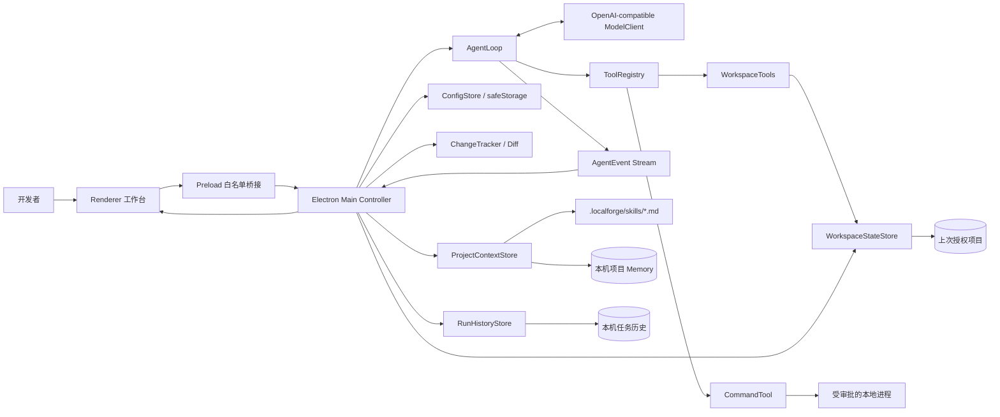
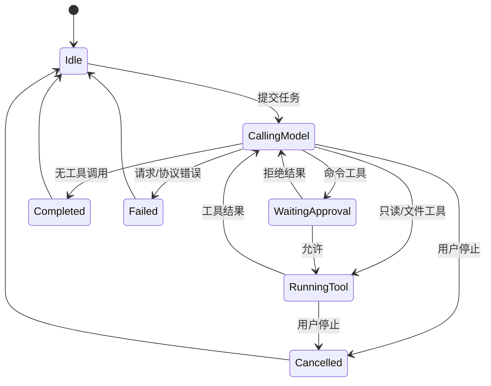

# 总体设计文档

## 1. 设计目标

RepoForge 必须让用户知道 Agent 正在做什么、为什么需要权限、修改了哪些代码以及怎样验证。独立桌面壳负责项目导航、代码预览、受限手动编辑和过程呈现；核心工作是可解释、可停止、可测试的本地 Agent 闭环。

## 2. 总体架构



## 3. 进程与模块职责

| 模块 | 职责 | 不负责的内容 |
| --- | --- | --- |
| `renderer/app.ts` | 项目树、代码预览、轻量编辑、时间线、审批、输出与 Diff | 直接文件系统和模型网络访问 |
| `preload.ts` | 通过 contextBridge 暴露固定 IPC API | 任意 Node API 或动态通道 |
| `main.ts` | 窗口安全策略、项目状态、IPC、任务编排和审批解析 | 决定模型下一步行为 |
| `desktop/projectService.ts` | 过滤项目树、限制文件预览、受限手动保存/新建、真实路径与摘要检查 | Agent 循环和变更归因 |
| `desktop/configStore.ts` | 多模型配置、旧格式迁移、按配置加密 Key、能力自检状态和活动配置 | 向 Renderer 暴露 Key 明文 |
| `desktop/projectContextStore.ts` | Skill 发现、Memory 隔离存储、上下文限制 | 自动执行 Skill 或修改项目文件 |
| `desktop/runHistoryStore.ts` | 按项目记录任务状态、事件、消息摘要和改动文件 | 保存 API Key 或写入用户项目 |
| `desktop/runOutcome.ts` | 从 AgentEvent 与变更快照计算成果指标和回放节奏 | 相信模型自述的测试数或触发新的执行 |
| `desktop/workspaceStateStore.ts` | 在应用数据目录原子保存上次成功授权的项目路径 | 接受 Renderer 提交的任意重开路径 |
| `agent/systemPrompt.ts` | 合并固定安全提示、Memory 和选中 Skill | 信任过期记忆代替读取代码 |
| `agent/taskContext.ts` | 组合原始任务、选中文件提示和有界附件正文 | 绕过固定 system prompt 或直接读取任意路径 |
| `agent/agentLoop.ts` | 消息历史、工具调度、循环、取消、终止和事件 | 具体工具实现 |
| `agent/planController.ts` | 计划版本、审批状态、动态工具门禁、清单与完成核验 | 提升原有项目权限或保存私有思考链 |
| `model/openAICompatibleClient.ts` | HTTP、严格响应解析和 tool call 协议校验 | 自动执行工具 |
| `agent/toolRegistry.ts` | 工具 schema、调用和统一错误结果 | UI 渲染 |
| `tools/workspaceTools.ts` | 列表、搜索、读取、修改、命令和边界保护 | Git 提交与推送 |
| `agent/changeTracker.ts` / `changeRestore.ts` | 首次写入前快照、内容摘要、冲突保护和用户确认后的恢复 | Git 版本控制 |

Renderer 对任务输入设置 20,000 字符上限用于即时反馈；主进程仍把 IPC 参数视为不可信输入，独立校验任务类型/长度、当前文件、附件路径、Skill id、Memory 开关和接续历史 id 后才读取配置或创建 AgentLoop。

## 4. Agent 循环

```text
initialize(system, task, tools, limits)
for step in 1..maxSteps:
    assistant = model.complete(messages, tools, signal)
    append assistant
    if assistant has no tool calls:
        finish only when the active completion gate passes
    for call in assistant.toolCalls:
        parse arguments
        execute registered tool or return structured error
        append result with the same tool_call_id
        emit observable event
fail safely when the step limit is exhausted
```

- 普通模型文本不能改变工作区；只有注册工具能产生本地副作用。
- 工具调用和结果严格按 `tool_call_id` 配对。
- 已进入循环的参数或工具错误被规范化并反馈模型，不破坏消息序列；模型响应本身结构损坏时明确失败。
- AbortSignal 同时控制模型请求、AgentLoop 和本地进程。
- 规划模式在写入前增加可编辑计划审批；ToolRegistry 同时在 schema 输出和执行入口按计划状态过滤工具，完成门禁不通过时继续下一轮模型调用。

## 5. 状态机



## 6. 工具协议

| 工具 | 核心参数 | 输出 | 权限 |
| --- | --- | --- | --- |
| `list_files` | `glob`, `limit` | 相对路径列表 | 自动，只读 |
| `search_text` | `query`, `include`, `limit` | 文件、行号、文本 | 自动，只读 |
| `read_file` | `path`, `startLine`, `endLine` | 带行号内容 | 自动，只读 |
| `replace_in_file` | `path`, `oldText`, `newText` | 修改统计 | 自动，项目内写入 |
| `write_file` | `path`, `content` | 创建/覆盖结果 | 自动，项目内写入 |
| `run_command` | `command`, `reason` | exit code、输出、超时、批准等待与执行耗时 | 每次人工批准 |
| `propose_plan` | `explanation`, `steps` | 用户编辑/批准后的计划 | 仅规划模式；副作用前必须批准 |
| `update_plan` | 完整 `items` 状态 | 当前计划快照 | 已批准计划；至多一项进行中 |
| `finish_task` | `verification`, `remaining` | 完成门禁结果 | 全部步骤终态且有核验证据 |

文件路径先做词法范围检查，再对既有目标或最近既有父目录做 `realpath` 检查。符号链接被跳过；依赖、缓存和构建目录不会进入默认遍历。列表与搜索达到结果上限后立即停止递归，遍历每层目录和文件前检查 AbortSignal，避免大仓库取消后继续空扫。命令 cwd 固定为项目根目录，子进程环境会剥离常见 Key、Token、Secret、Password、Credential 和 Auth 变量，输出保留长度受配置限制。命令工具分别记录人工批准等待与本地进程执行耗时，AgentLoop 的整次工具调用耗时仍可用于总链路分析，两者不能混为性能数据。

## 7. 桌面安全边界

- Renderer 启用 `contextIsolation` 和 `sandbox`，关闭 `nodeIntegration`。
- Preload 只暴露预定义方法，不向页面提供 `ipcRenderer`。
- 拒绝新窗口与页面导航；CSP 只允许加载本地脚本和样式。
- 动态内容通过 `textContent` 渲染，模型文本不会拼入 HTML。
- API Key 在主进程读取；系统支持时由 `safeStorage` 加密，Renderer 不获得明文。
- 同一时刻只运行一个任务，运行期间禁止切换项目；命令审批使用右侧内嵌卡片，不以遮挡整个工作台的全屏模态框代替安全确认。

`ConfigStore` 使用版本 2 结构保存最多 12 个模型配置和唯一活动 id。每项独立保存名称、API 地址、Model-Id、权限、响应档位、绑定该 API 地址的加密 Key 和最近自检结果；列表 IPC 只返回 Key 是否存在。旧版单配置文件读取时映射为 `default` 配置，原加密内容和参数不丢失。保存新配置会将其设为活动项，顶栏切换只影响下一条任务；运行中主进程拒绝保存、切换或删除。删除需要界面二次确认并至少保留一项。任务历史记录启动瞬间的配置名称、实际模型、权限和档位，因此后来切换不会改写既有证据。

## 8. 上下文与变更审查

系统提示包含角色、工作区约束、审批和验证原则。用户任务可带当前选中文件路径；模型必须通过文件工具读取实际内容。消息历史保留每轮回复、tool call 与 tool result。

附件是用户显式选择的当前项目文本文件，一次最多 8 个。系统选择器返回路径后，主进程仍通过项目真实路径边界和单文件 1 MB 上限重新读取，拒绝含 NUL 的二进制内容；注入模型时每个文件最多 24,000 字符，全部附件正文最多 64,000 字符，并在上下文中标记为不能覆盖 system prompt 的只读项目数据。附件路径写入任务历史用于审计，保存当前运行消息时将带附件的模型输入还原为用户可见的原始任务，正文不复制到历史详情。

项目 Skill 是 `.localforge/skills` 下最多 24 个、每个不超过 32 KB 的 Markdown 文件。界面通过白名单 IPC 新建、读取、编辑和删除；主进程限制文件名字符集，拒绝重复、空正文、符号链接、目录逃逸和编辑时静默改名，写入后重新扫描元数据。删除采用界面二次确认并同步清理选择状态。每次任务最多选择 8 个，注入正文总量不超过 64,000 字符；Renderer 只提交 Skill id，主进程在任务开始时重新扫描并读取，避免把页面编辑内容直接冒充已保存文件。Skill 可约束项目工作方式，但不能覆盖路径、审批和系统安全边界。

Memory 是用户维护的轻量文本，最多 12,000 字符。`ProjectContextStore` 使用项目真实路径的 SHA-256 摘要作为存储键，文件位于 Electron `userData/project-memory`，因此不会污染项目仓库。保存使用临时文件原子替换；保存空内容或明确二次确认删除都会移除对应文件，而不是保留一个伪空记录。上下文快照同时返回最后更新时间和字符数；Renderer 展示压缩后的注入开头，并通过系统文件选择器导入/导出受限文本。保存、导入和本次启用仍分开控制。主进程只在 `useMemory: true` 时读取并注入，同时明确标记“可能过期，应以当前文件核实”。首版不做向量检索、自动记忆或模型自主改写，避免形成不可观察的隐式状态。

`RunHistoryStore` 使用相同的真实路径摘要隔离项目，文件位于 Electron `userData/run-history`。任务启动时先写入 `running` 记录，结束后原子更新为 `completed`、`cancelled` 或 `failed`；应用重启后遗留的 `running` 记录在读取时映射为 `interrupted`。每个项目最多保留 50 次任务、每次最多 200 条事件和 160 条消息；私有 reasoning 字段被移除，API Key 从未进入历史对象。任务结束时 `runOutcome` 从同一组事件、成功命令输出和 ChangeTracker 快照计算成果指标并随详情保存；测试数无法识别时不猜测，大文件行数退化为带近似标记的边界统计。历史接续通过 `continuedFromRunId` 形成项目内父链；同一会话发送下一条消息时自动使用当前末次运行作为父记录，选择历史可切换父链，“新会话”则清除父记录而不删除历史。删除会话时先沿父链定位根节点，再删除该根及所有后继记录；主进程在任务活动期间拒绝删除，Renderer 清除已失效的活动会话状态，但不会撤销项目文件。开始新任务前只提取有界的用户/assistant 文本，不重放旧工具调用或旧 system prompt，再由当前设置、Skill、Memory 和附件生成新的上下文。Renderer 只通过白名单 IPC 读取、维护或删除明确允许的数据。

`WorkspaceStateStore` 只在系统目录选择器成功返回且项目扫描完成后保存根路径；Renderer 的恢复 IPC 不携带路径参数，因而不能借“自动恢复”打开未授权目录。启动时主进程读取该固定状态并重新执行完整项目扫描；目录不存在、不可读或扫描失败时清除状态并返回空白工作台。未发送任务草稿留在 Renderer 的本机 `localStorage`，按项目路径的稳定摘要分槽，值内仍保留原路径用于碰撞校验；它不进入项目、历史或模型请求，任务成功启动或新建会话后立即清除。

ChangeTracker 在任务中对每个文件只捕获一次原始内容。任务结束后主进程读取当前内容并记录 SHA-256 摘要，Renderer 提供双栏只读对比。用户二次确认后可恢复单个或全部跟踪文件；主进程先重新读取并比较摘要，发现任务结束后的外部修改就拒绝覆盖。恢复新文件会删除该文件，恢复既有文件会写回首次快照，并从当前变更集合移除。系统仍不自动提交或推送。

运行前的上下文清单复用真实的 system prompt、任务包装、历史父链、Skill/Memory/附件读取与权限过滤，只把消息和工具 schema 做本地 Token 估算，不读取 Key、不发起模型请求。模型自检则由 `modelDiagnostics` 发出小型文本请求与固定无副作用工具 schema，独立报告认证、文本、流式、usage 和 tool calling。历史导出通过 `runReport` 将状态、配置、上下文标记、可观察事件和改动路径转换为 Markdown，不读取已移除的 reasoning。

设置中的权限不是装饰字段。`readOnly` 只把 `list_files`、`search_text`、`read_file` 注册给本次 ToolRegistry；`workspace` 才包含精确替换、写文件和命令工具，命令仍逐次审批。响应档位分别把兼容接口的 `max_tokens` 设为 4,096、8,192、16,384，并同步约束 Agent 的探索风格；该字段描述单轮输出预算与任务深度，不宣称改变服务端每秒生成速度。

每轮模型完成时解析标准 `usage.prompt_tokens`、`usage.completion_tokens` 和 `usage.total_tokens`，兼容流末尾 `choices: []` 的 usage-only 分片。部分兼容服务会返回全零 usage 占位包；非空请求与回答不可能真实消耗 0 Token，因此全零包按“未提供”处理。服务未提供有效 usage 时，使用包含消息和工具 schema 的保守字符权重估算，并把 `estimated: true` 贯穿 AgentEvent、实时 Token 标记和历史详情，界面始终用 `≈` 区分估算与接口精确值。旧历史中的全零记录也会在展示时重新估算。

## 9. 错误处理

| 错误 | 处理 |
| --- | --- |
| 模型认证、限流或无效响应 | 429 与常见 5xx 按 `Retry-After` 或短退避有限重试且可取消；仍失败时给出明确指引，保留时间线和已有变更 |
| 模型响应 JSON、choices 或 tool call 结构无效 | 产生明确协议错误并终止当前任务，不显示虚假完成 |
| 已进入循环的工具参数或工具执行无效 | 形成结构化工具错误结果，允许模型后续修正；连续 3 次完全相同的失败调用触发熔断并指出工具名与原始错误，避免耗尽全部步骤 |
| 路径越界或符号链接逃逸 | 拒绝操作并返回明确错误 |
| 含糊文本替换 | 不写入，要求重新读取或缩小目标 |
| 用户拒绝命令 | 不创建进程，将拒绝作为工具结果返回 |
| 命令超时或用户停止 | Windows 使用系统进程树终止；POSIX 使用进程组终止并在必要时强制清理；返回已有输出或取消状态 |
| 文件过多/过大 | 过滤后的目录树完整扫描，只传相对路径并按展开状态生成节点；预览与 Agent 单文件读、改、写最多 1 MB |
| Skill 缺失/过大 | 重新扫描后忽略，未勾选内容不进入上下文 |
| 附件越界/过多/二进制 | 在模型请求前拒绝；超出正文上限时明确截断，不读取项目外文件 |
| Memory 过长/损坏 | 拒绝保存或明确提示本地数据读取失败 |
| 任务运行中应用退出 | 下次打开历史时标记为“意外中断”，保留开始记录 |
| 上次项目失效 | 清除工作区状态并回到空白工作台，不尝试猜测或扩大目录权限 |
| 本机草稿存储不可用 | 忽略持久化错误，不阻断任务输入与提交 |
| 手动保存发生外部冲突 | 比较打开时与当前磁盘摘要；不一致时拒绝覆盖并要求重新打开 |
| 手动新建目标已存在或父目录无效 | 不写盘，提示选择已存在的项目内父目录和未占用名称 |
| 编辑未保存时切换上下文 | Renderer 阻止切换、刷新或启动 Agent，要求先保存或取消 |

## 10. 可扩展点

ModelClient 和 ToolRegistry 已通过接口隔离，可增加其他兼容协议或工具。Skill 当前只作为用户选择的 Markdown 上下文，不加载代码或动态注册工具。首版只加入满足文件修正需要的轻量文本编辑，不扩展为带语言服务、调试器、终端或 Git 集成的完整编辑器；多 Agent、远程执行和动态插件仍不进入当前版本。

## 11. 架构基线评审

### 11.1 基线判定

中期架构基线由以下内容共同组成：本文件的进程/模块/状态机/工具设计、`11-智能体数据流.md` 的端到端数据流、两个 ADR 的形态决策，以及 `contracts.ts` 中 Renderer 与主进程共享的数据契约。普通 UI 调整不改变架构基线；新增进程、远端服务、持久化格式、通用 IPC、可执行插件或新的本地权限必须重新进行架构评审。

### 11.2 评审检查表

| 检查项 | 当前结论 | 证据 |
| --- | --- | --- |
| 依赖方向 | Renderer → Preload → 主进程；Agent 核心不依赖 Electron | 源码导入关系、类型检查 |
| 信任边界 | Renderer、模型响应、项目 Skill/附件均按不可信输入处理 | IPC、协议和路径测试 |
| 副作用入口 | 文件和命令只能经注册工具；命令逐次审批 | ToolRegistry、WorkspaceTools |
| 数据隔离 | Key、Memory、历史不写入项目；Skill 明确属于项目文件 | ConfigStore、ProjectContextStore、RunHistoryStore |
| 失败确定性 | 完成、取消、最大步骤、协议错误和重复失败均有终态 | AgentLoop 测试与状态机 |
| 可测试性 | 核心服务可脱离 Electron 测试；桌面边界有 IPC 测试 | 29 个测试文件、135 项测试 |

### 11.3 冻结前允许的架构变化

恢复上次项目、文件快速打开、行号/复制和步骤耗尽继续入口已按现有分层实现。经 08-28 评审批准的轻量手动编辑只增加固定 IPC 和项目服务能力，不新增进程、服务、持久化格式或通用文件访问；完整编辑器、多 Agent、云端服务、数据库、动态插件、内置终端和 Git 客户端仍不进入当前版本。详细阶段门禁与工作量估算见 [16-中期生命周期基线.md](../历史归档/16-中期生命周期基线.md)。

## 12. 轻量手动编辑设计

手动编辑沿用 `Renderer → Preload 白名单 → Main → ProjectService` 的信任边界。打开文件时主进程返回 SHA-256 内容摘要；保存请求必须带回该摘要，主进程重新读取磁盘并比较，只有内容未被外部程序改变才允许写入。新建文件使用排他创建，要求父目录已存在且真实路径仍位于项目根目录。

正文按 UTF-8 字节限制为 1 MB，并拒绝 NUL 内容。Agent 运行期间主进程和 Renderer 双重拒绝保存或新建；编辑未结束时 Renderer 阻止切换文件、项目和刷新。界面保留原文件换行风格，`Ctrl+S` 与保存按钮共用同一流程。

手动编辑与 Agent 证据分离：新建的手动文件不加入 `ChangeTracker`；若用户手动保存 Agent 已修改的文件，主进程从本次 Agent 变更集合中移除该路径并刷新 Diff 列表。该选择牺牲混合修改的逐段归因，换取不会把用户内容误报为模型产出的确定性边界。
