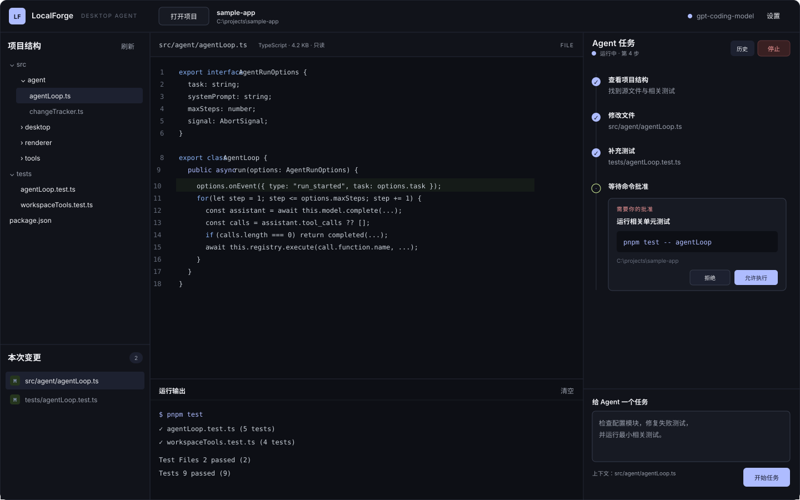

# 界面原型与交互说明

## 1. 原型

原型是一套独立桌面工作台，不嵌入 VS Code。它展示完成 Agent 任务所需的代码结构与结果，并提供受限的文本编辑和新建文件能力，但不承担完整 IDE 的语言服务、调试或版本控制功能。

视觉上使用低饱和蓝紫作为唯一主强调色，以深色工作台承载三个功能面。区域仍保持清晰边界，但通过渐变、圆角、轻阴影和留白区分层级，避免把整个窗口表现成密集表格。任务输入区作为浮动卡片强调“下一步操作”，项目树则使用柔和选中态和更舒展的行高保证长时间阅读。

## 2. 信息结构

### 顶部：应用与项目

- LocalForge 标识与“Desktop Agent”产品形态。
- “打开项目”、当前项目名与本地路径。
- 模型快速切换、能力状态以及设置入口；选项区分 Agent 已验证、需检查、未测试和缺少 Key。

### 左侧：项目结构与变更

- 上半区显示过滤后的目录树；依赖、缓存和构建目录不出现。
- 下半区集中列出本次 Agent 修改的文件及数量。
- 标题区提供“新建文件”；文件点击进入预览，变更文件点击进入 Diff；变更区可二次确认全部撤销；`Ctrl+P` 打开居中的文件搜索框，支持模糊搜索、方向键和 Enter。

### 中间：代码与证据

- 顶部显示相对路径、语言、大小、复制路径/内容操作和 FILE/DIFF 模式。
- FILE 模式默认显示带固定行号槽的源码，可切换为轻量编辑区并保存或取消；DIFF 模式保持只读，并排显示修改前与修改后并提供二次确认的单文件撤销。
- 底部保留运行输出，用于展示命令、stdout、stderr 和工具结果。

### 右侧：Agent 任务

- 头部显示待命、运行中、失败状态、“新会话”、历史入口和停止按钮。
- 右侧是连续可滚动的会话流：用户问题显示为右侧气泡，Agent 在左侧气泡中实时追加可见文本，完成后再安全解析 Markdown；工具调用仍等参数完整后展示和执行。
- 同一会话的新任务不清空已有消息并自动继承上一轮；“新会话”清空当前视图与上下文链，但保留历史。打开项目时恢复最近活动会话的最多 12 次父链。用户向上阅读时，流式更新不会强行拉回底部。
- 时间线逐步展示模型回合、读/改/测工具和耗时；命令区分批准等待与真实执行时间。等待命令决定时，在时间线与输入框之间展开轻量审批卡，不遮住项目树、代码和已有过程。
- Agent 总结使用安全的轻量 Markdown 排版，历史事件折叠重复长文本，完整结果仍可阅读和复制。
- 底部输入任务，并提示当前选中的文件上下文。
- 输入框上方以紧凑按钮提供“附件”、`Skill`、`Memory` 与“发送清单”；发送清单在本地展示预计 Token 和实际上下文组成，不调用模型。
- Skill 按“已选/总数”显示状态，弹窗内可新建、编辑、二次确认删除；Memory 显示“未设置/已启用/未启用”，弹窗内显示更新时间、注入预览并提供导入、导出、删除和独立启用控制。
- 启动时恢复上次成功授权的项目和该项目未发送草稿；达到步骤上限时在时间线内显示中文说明与“继续此任务”按钮，按钮只准备可编辑文本，不自动发送。

## 3. 关键状态

| 状态 | UI 表现 | 可用操作 |
| --- | --- | --- |
| 未打开项目 | 中间显示打开项目引导 | 打开项目、配置模型 |
| 项目就绪 | 左侧目录树、中间项目摘要 | 选文件、提交任务 |
| 配置上下文 | Skill 列表/编辑器或 Memory 编辑框以模态方式出现 | 新建、编辑、勾选、重扫、保存、启用/停用、二次确认删除 |
| 管理模型配置 | 设置弹窗列出已保存配置、名称、服务和能力结果 | 新建、重命名、保存并测试、二次确认删除；顶栏快速切换 |
| 运行中 | 状态点高亮、时间线持续追加 | 查看过程、停止 |
| 等待审批 | 右侧内嵌卡显示原因、命令、cwd 和等待状态 | 运行命令、暂不执行、查看其他区域 |
| 修改完成 | 左侧出现变更文件 | 查看双栏 Diff、二次确认撤销单个/全部变更、继续任务 |
| 失败/取消 | 时间线保留错误和已有结果 | 修正配置、重新提交 |
| 回看/继续历史 | 模态框左侧列出任务，右侧显示摘要、事件和改动文件 | 选择记录、切换并继续、导出证据报告、二次确认删除整段会话、关闭弹窗 |
| 新会话/附件待发送 | 聊天区显示空白引导；输入区显示附件标签和数量 | 添加/移除项目文件、输入任务、发送 |
| 快速打开 | 居中搜索框列出按文件名/路径排序的最多 60 个结果 | 输入过滤、上下选择、Enter 打开、Esc 关闭 |
| 达到步骤上限 | 状态显示“可继续”，时间线保留原因和继续入口 | 编辑继续指令并明确发送、审查已有改动 |
| 手动编辑 | 中间显示文本编辑区、未保存状态和保存/取消操作 | 输入、`Ctrl+S` 保存、二次确认放弃；其他上下文切换暂时锁定 |
| 新建文件 | 居中弹窗填写相对路径和初始正文 | 创建到已存在目录或取消；重名与越界明确报错 |

## 4. 交互规则

- 同一时刻只允许一个任务；运行期间不能切换项目。
- FILE 模式允许显式手动编辑或新建文本文件；DIFF 仍只读。手动保存不进入 Agent 历史或本次 Agent 变更区，避免错误归因。
- 编辑未保存时禁止切换文件、项目、刷新或启动 Agent；磁盘摘要冲突时拒绝覆盖。Agent 运行期间禁止手动保存和新建。
- 每条本地命令都单独审批，拒绝不会伪造执行结果。
- 审批卡不能用关闭或 Escape 静默跳过，必须明确选择执行或不执行；减少视觉打断不等于降低权限边界。
- 模型设置支持最多 12 个配置，提供名称、预设/自定义 Model-Id、独立 Key、只读/工作区读写权限和快速/标准/深入响应档位；运行期间顶栏与设置入口锁定。
- Agent 状态旁持续显示本次任务累计 Token；接口返回 usage 时显示精确值，使用本地估算时必须带 `≈`，悬停可查看输入、输出与合计。
- “完成”与测试是否通过分开表达；输出面板保留真实证据。
- 停止后保留已修改文件和时间线，供用户审查。
- 所有动态文本按纯文本渲染，避免模型输出注入界面。
- 未发送草稿按项目隔离；成功发送、新建会话后清除，恢复草稿不自动恢复附件或改变 Skill/Memory 选择。
- 大目录只渲染当前已展开的分支；当前会话最多保留 500 个消息/事件节点并恢复最近活动记录的最多 12 次父链，输出区约 100,000 字符后滚动截断旧内容。

## 5. 原型到实现的对应关系

| 原型区域 | 实现文件 |
| --- | --- |
| 桌面窗口与顶栏 | `src/main.ts`、`src/renderer/index.html` |
| 项目结构 | `src/desktop/projectService.ts`、`src/renderer/app.ts` |
| 工作区恢复与草稿 | `src/desktop/workspaceStateStore.ts`、`src/renderer/features/taskDraft.ts` |
| 代码、轻量编辑与 Diff | `src/renderer/features/manualEditor.ts`、`src/renderer/app.ts`、`src/desktop/projectService.ts` |
| 快速打开 | `src/renderer/features/quickOpen.ts`、`src/renderer/app.ts` |
| 时间线与审批 | `src/renderer/app.ts`、`src/main.ts` |
| Skill 与 Memory | `src/desktop/projectContextStore.ts`、`src/agent/systemPrompt.ts`、`src/renderer/app.ts` |
| 新会话与附件 | `src/agent/taskContext.ts`、`src/main.ts`、`src/renderer/app.ts` |
| 任务历史 | `src/desktop/runHistoryStore.ts`、`src/main.ts`、`src/renderer/app.ts` |
| 视觉样式 | `src/renderer/styles.css` |

实际桌面窗口已于 2026-08-27 完成三轮启动检查。2026-08-28 又使用独立演示项目完成一次重启验收：`Ctrl+P` 弹窗、键盘打开、行号槽和复制按钮布局正常；写入未发送草稿后关闭并重启，项目、历史会话和草稿均恢复，验收草稿随后已清除。
