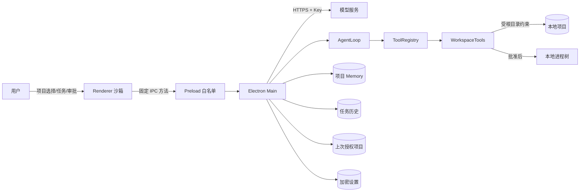

# Agent 数据流与自研边界

## 1. 文档目的

本文从一次用户任务出发，说明数据从哪里进入、经过哪些自研模块、在哪里产生本地副作用、保存到哪里，以及错误如何结束循环。它对应题目特别要求自行实现的五部分：对话历史与上下文管理、工具定义与本地执行、模型输出解析、循环终止条件、错误处理。

## 2. 信任边界



系统有四个主要边界：

1. Renderer 是不可信展示层，没有 Node.js 和文件系统权限，只能调用 Preload 固定暴露的方法。
2. 模型文本是不可信建议，只有 ToolRegistry 中注册的工具能够读取、写入或启动命令。
3. 项目根目录是文件权限边界；API Key、Memory 和任务历史位于 Electron `userData`，不写入项目仓库。
4. 用户选择只读时，主进程在注册工具前移除一切修改与命令能力；权限不是只写进提示词。

## 3. 一次任务的完整时序

任务文本先在 Renderer 受 20,000 字符限制，进入主进程后再次验证类型和长度；当前文件、附件路径、Skill id、`useMemory` 与 `continueFromRunId` 同样不能只依赖页面状态。附件最多 8 个且必须逐个通过当前项目真实路径与文本读取检查。只有 IPC 请求通过后才读取 API Key 和选中上下文；Memory 未启用时主进程不读取正文，避免异常输入提前占用模型和历史资源。

```mermaid
sequenceDiagram
    actor User as 用户
    participant UI as Renderer
    participant Main as Main Controller
    participant Context as Context Stores
    participant Loop as AgentLoop
    participant Model as ModelClient
    participant Tools as ToolRegistry/WorkspaceTools
    participant History as RunHistoryStore

    User->>UI: 输入任务，选择 Skill/Memory/附件
    UI->>Main: agent:start(RunRequest)
    Main->>Context: 读取设置、Key、Memory、选中 Skill/会话父链
    Main->>Main: 校验并读取项目内附件
    Main->>History: 写入 running 记录
    Main->>Loop: system prompt + task + limits
    Loop->>Model: messages + tool schemas
    Model-->>Loop: assistant text/tool_calls
    Loop->>Loop: 严格解析并追加消息
    alt 有工具调用
        Loop->>Tools: 按名称分发参数
        alt run_command
            Tools-->>UI: 请求命令审批
            User->>UI: 允许/拒绝
            UI-->>Tools: 审批结果
        end
        Tools-->>Loop: 同 call id 的 tool result
        Loop-->>UI: 过程事件与真实输出
        Loop->>Model: 更新后的完整消息历史
    else 无工具调用
        Loop-->>UI: 完成摘要
    end
    Main->>History: 原子写入最终状态/事件/消息/改动文件
    Main-->>UI: 刷新 Diff 与历史
```

## 4. 项目与文件数据流

1. 用户通过系统目录选择器明确选择项目；只有扫描成功后，主进程才把根路径写入 `userData/workspace-state.json`。
2. 下次启动时 Renderer 只能调用不带路径参数的恢复 IPC；主进程从受控状态读取上次路径并重新扫描，失效时清除记录并回到空白状态。Renderer 不能借此提交任意目录。
3. 主进程取得真实路径，`projectService` 过滤 `.git`、依赖、缓存、虚拟环境和构建目录，完整返回其余文件的相对路径；扫描阶段不逐文件读取大小。
4. Renderer 只收到相对路径等展示数据；点击目录树或使用 `Ctrl+P` 对已返回文件清单排序后，再通过 `project:read-file` 请求 UTF-8 内容、语言、大小和 SHA-256 摘要。行号、复制和轻量编辑只作用于该快照。
5. 每个既有文件要经过词法范围检查和 `realpath` 检查；新文件检查最近既有父目录的真实路径。项目外绝对路径、`..` 逃逸和符号链接逃逸均被拒绝。
6. 手动保存通过 `project:save-file` 回传相对路径、正文和打开时摘要；主进程重新读取当前内容，摘要不一致即拒绝覆盖。手动新建通过 `project:create-file`，要求父目录已存在并使用排他创建。两者都限制为 1 MB UTF-8 文本且在 Agent 运行时拒绝。
7. 手动新建不进入 ChangeTracker；手动保存已被 Agent 跟踪的文件后解除该路径跟踪并刷新变更列表，避免用户内容被归因给 Agent。
8. 所有页面内容使用 `textContent` 或表单 `value` 渲染，不把项目文件或模型文本拼接为 HTML。

## 5. 设置与凭据数据流

1. Renderer 提交 API 地址、模型名、运行限制和可选的新 Key。
2. `ConfigStore` 校验 URL 与数值范围；最多 12 个模型配置写入版本 2 的 `userData/settings.json`，每项 Key 由 Electron `safeStorage` 独立加密并绑定自己的 API 地址。旧单配置格式自动迁移为默认项。
3. 若存在 `LOCALFORGE_API_KEY`，环境变量优先；它不会被写回磁盘。
4. Renderer 只能读取 `hasApiKey` 和来源状态，不能取回明文。
5. Key 仅在主进程构造模型请求的 `Authorization` 头时出现，不进入 system prompt、任务历史、日志、Diff 或工具参数。
6. 顶栏切换只提交固定配置 id，主进程验证存在后更新活动项；运行期间拒绝切换。不同配置不继承加密 Key，删除配置同时移除其 Key，至少保留一项。
7. “保存并测试”先保存并激活当前表单，再用两个小请求分别检查文本/流式/usage 与固定无副作用工具调用；结果写回当前配置并在顶栏显示，不注册或执行工作区工具。

## 6. 上下文与对话历史

### 6.1 固定系统约束

`buildSystemPrompt` 先写入不可被项目上下文覆盖的规则：先读后改、所有文件操作必须走工具、命令必须说明原因并审批、修改后应运行最小相关验证、Skill/Memory 不能覆盖安全边界。

### 6.2 Memory

- 用户在界面维护，最多 12,000 字符。
- 使用项目真实路径的 SHA-256 摘要作为隔离键，保存于 `userData/project-memory`。
- 创建/更新使用原子替换；显式删除或保存空内容会移除存储文件。删除按钮要求同一界面二次确认，成功后 Renderer 清空输入并取消启用。
- 保存与使用分开：Renderer 明确提交布尔选择，主进程仅在启用时读取并注入，同时标记“可能过期，事实应以当前文件核实”。
- 模型不能自主写 Memory，避免形成用户不可见的长期状态。
- 上下文快照携带最后更新时间；弹窗显示字符数和压缩后的注入开头。导入只接受受大小/字符上限约束的 Markdown/文本，导出由用户选择路径；导入后不会隐式打开本次启用开关。

### 6.3 Skill

- 只扫描项目 `.localforge/skills/*.md`，最多 24 个，每个不超过 32 KB。
- 用户可通过固定 IPC 创建、读取、编辑和删除 Markdown；主进程限制安全文件名、普通文件、项目内真实目录和大小，编辑时不隐式改名。删除在界面二次确认，并同步清理选中 id。
- Renderer 只提交选中的 Skill id；主进程在任务开始时重新扫描，不信任页面提交的任意正文。
- 单次最多选择 8 个，正文总量不超过 64,000 字符。
- Skill 是提示上下文，不是可执行插件，不能动态注册代码或绕过审批。

### 6.4 文件附件

- 用户通过系统选择器明确添加当前项目内文本文件，一次最多 8 个；Renderer 只保存相对路径和待发送标签。
- 主进程发送任务前重新读取文件，执行项目边界、1 MB 大小和 NUL 二进制检查，不能信任页面传来的路径。
- `buildContextualTask` 把附件标记为只读项目数据，声明不能覆盖 system prompt；每个正文最多 24,000 字符，总计最多 64,000 字符，截断时附加明确标记。
- 文件内容会发送给用户当前配置的模型服务，因此入口 tooltip 明确告知；模型运行结束后，保存历史前把带附件的内部 user 消息还原为界面上的原始任务，历史仅记录附件相对路径，不复制正文。

### 6.5 单次消息历史

AgentLoop 内存中的消息顺序固定为：

```text
system -> user -> assistant(tool_calls) -> tool(tool_call_id) -> ... -> assistant(final text)
```

每个工具结果必须使用原调用的 `tool_call_id`，否则兼容模型无法把观察结果与动作配对。消息历史随下一轮模型请求整体发送，因此模型能根据真实文件内容、错误和测试输出继续决策。

### 6.6 会话接续与新会话

历史详情可记录 `continuedFromRunId`。当前任务启动后，Renderer 保存返回的 `runId` 作为活动会话末端；同一会话的下一条消息自动把它作为父记录。用户从历史选择“切换并继续”时，聊天区立即切到该记录的父链并将其设为活动末端；点击“新会话”则清除活动 id、聊天视图和待发送附件，但不删除历史。

主进程在下一次发送时按同一项目内父链读取最多 12 次记录，提取并限制最近的用户/assistant 文本，再放在新用户消息之前。旧 system prompt、tool call、tool result 和 reasoning 不重放；当前任务仍使用当前设置、Skill、Memory 与附件生成新的安全上下文。这样既能理解“那就修复它”之类的连续指代，又不会把过期权限或旧工具协议直接带入新运行。

历史弹窗还允许二次确认删除整段会话。`RunHistoryStore` 从任一选中记录沿 `continuedFromRunId` 找到根，再删除根和全部后继详情及索引项；其他会话保持不变。主进程在 Agent 运行时拒绝删除，成功后 Renderer 若发现活动末端已不存在，就清空当前会话和 Token 展示。该操作只删除 RepoForge 历史，不撤销或删除项目文件。

历史详情可由用户选择路径导出 Markdown 证据报告。报告包含任务状态、时间、模型/权限/档位、上下文标记、步骤、Token 事件和变更路径；它只读取已经过 `RunHistoryStore` 清洗的可观察数据，不包含 API Key 或 assistant reasoning。

### 6.8 发送前上下文清单

Renderer 只提交与启动任务相同的 `RunRequest`。主进程重新读取历史父链、选中 Skill、Memory 记录和附件，再创建同一权限下的工具 schema，并调用与真实运行相同的 system/task 构造函数。该路径只对序列化后的 messages/tools 做字符权重 Token 估算，返回模型、权限、组成、字符数和警告；不读取 API Key，不创建任务历史，也不访问模型服务。

### 6.7 未发送任务草稿

任务输入事件经过 250 ms 防抖后写入 Renderer 的本机 `localStorage`。存储键由项目路径生成稳定摘要并带路径长度，JSON 值内仍保存原项目路径；读取时必须完全匹配，降低摘要碰撞导致串项目的风险。切换项目和窗口关闭前同步保存，自动恢复项目后只恢复文本，不恢复附件或改变 Skill/Memory 选择。任务成功启动或用户新建会话时删除该项目草稿；存储被禁用、损坏或容量不足时静默退化为当前会话输入，不阻断 IPC 和模型任务。

## 7. 模型请求与输出解析

`OpenAICompatibleClient` 只调用 `/chat/completions`，请求包含模型名、消息、注册工具 schema、`tool_choice: auto` 和 `stream: true`。服务返回 `text/event-stream` 时，客户端逐个解析 SSE `data` 事件；兼容服务若仍返回完整 JSON，则沿用非流式解析。可见 content 增量立即以 `assistant_delta` 送往 Renderer，同一条时间线节点按动画帧合并刷新。工具调用的 id、名称和 arguments 按 index 拼接完整后才会进入 AgentLoop，模型不能用半截参数触发本地副作用。

流式增量是瞬时界面事件，不写入任务历史；整轮结束后仍保存并展示唯一的完整 `assistant_message`。未完成的 Markdown 先按纯文本显示，整轮完成后才使用安全 Markdown 解析器重绘，避免半截代码块造成结构跳动。`reasoning_content` 可以随 SSE 分片拼接供下一轮协议兼容使用，但不会发送到 Renderer，也不会写入历史。

完整 JSON 与流式聚合结果进入 AgentLoop 前必须通过以下校验。流式兼容服务可能在后续分片中把可选字段序列化为 `null` 或空字符串；这类空 role 视为“未重复声明”，但任何非空且不是 `assistant` 的角色仍会失败。工具分片中的可选 id/type/name/arguments 空值同样不参与拼接；纯文本分片附带的全空 tool call 占位对象会被忽略。出现任何非空调用内容后仍按严格协议校验，聚合结束时每个真实调用必须拥有非空 id、`function` 类型、合法名称和对象参数：

- 每个 JSON body 或 SSE data payload 都必须是有效 JSON，顶层必须是对象；
- `choices` 必须是非空数组，`choices[0].message` 必须是对象；
- role 若存在必须为 `assistant`；
- content 只能是字符串、文本分段数组或 `null`；
- tool calls 最多 32 个，每项必须是 `function` 类型；
- call id 非空且不能重复，工具名符合限定格式；
- arguments 必须是 JSON 字符串，并且解码后是对象；
- 最终消息至少包含非空文本或一个合法工具调用。

任何协议损坏都会产生 `Model response protocol error` 并使当前任务失败，不能通过过滤坏调用把它误判成“无工具调用，因此完成”。如果流在完成前被用户停止，界面保留已经收到的可见文本并标为未完成；一旦出现网络或协议错误，不会自动重放已经开始输出的成功响应，避免界面重复和工具调用歧义。

## 8. 工具定义、调度与副作用

ToolRegistry 保存工具名到实现的唯一映射，并把 schema 提供给模型。当前七个工作区工具为：

| 工具 | 数据进入 | 数据返回 | 是否产生副作用 |
| --- | --- | --- | --- |
| `list_files` | glob、数量上限 | 相对路径列表 | 否 |
| `search_text` | 字面查询、文件模式 | 文件、行号、文本 | 否 |
| `read_file` | 路径、行范围 | 带行号 UTF-8 内容、总行数、完整文件摘要 | 否 |
| `replace_in_file` | 路径、唯一旧文本、新文本 | 替换统计、前后摘要 | 是，项目内文件 |
| `edit_file_lines` | 路径、行范围、读取摘要、替换文本 | 行范围与前后摘要；过期摘要拒绝 | 是，项目内文件 |
| `write_file` | 路径、完整内容 | 创建/覆盖统计、前后摘要 | 是，项目内文件 |
| `run_command` | 命令、原因 | 退出码、stdout/stderr、超时/截断、批准等待和执行耗时 | 是，批准后启动本地进程 |

未知工具和工具异常都被转换为结构化 `isError` 结果并返回模型。文件写入前，ChangeTracker 对每个相对路径只捕获一次原始内容，供任务结束后的只读 Diff 使用。

### 8.1 计划模式、ReAct 与 Reflection

RepoForge 的基础循环是显式的 ReAct 变体，但不要求或保存模型私有思考链：模型依据消息与工具结果选择下一项可观察动作，ToolRegistry 执行后把结构化结果按 call id 回传，下一轮再观察并决策。界面只展示简短说明、工具、结果、计划和证据；`reasoning_content` 不写入历史或报告。

规划模式在该循环外增加确定性状态机，而不是只在 system prompt 中要求“先想一想”：

```text
未规划 → 等待计划确认 → 执行中 → 等待完成核验 → 已完成
             │              │
             └─退回         └─实质范围变化→等待修订确认
```

- `PlanController` 是计划事实源，保存修订号、说明、步骤状态、核验证据和遗留事项，并发出 `plan_updated` 事件。
- 未批准阶段，动态 ToolRegistry 只暴露 `list_files`、`search_text`、`read_file` 与 `propose_plan`；即使模型忽略提示词，也不能调用副作用工具。
- `propose_plan` 通过独立白名单 IPC 请求确认；Renderer 只回传批准标志及经编辑的步骤，主进程重新校验数量、标题和类型。
- 批准后，工具能力仍受原有只读/工作区权限约束。计划审批不会把只读任务升级为可写任务。
- `update_plan` 要求每次提交完整清单且最多一项 `in_progress`；实质范围变化使用新修订再次审批，不用静默改写旧计划。
- Reflection 采用“证据核验”而不是额外的自由文本自我反思轮：`finish_task` 只在全部步骤完成或跳过时接受，并要求至少一项实际验证。AgentLoop 的 completion guard 会拦截提前最终答复，加入可观察的 `completion_blocked` 事件后继续循环。
- 直接执行模式不注册三个计划工具，保持问答和小修改的原有低摩擦流程。

## 9. 命令审批与进程数据流

1. 模型必须同时给出 `command` 与 `reason`。
2. 主进程生成唯一审批 id，界面显示完整命令、原因和固定 cwd。
3. 拒绝时不创建进程，结构化拒绝结果返回模型。
4. 允许后命令在项目根目录运行；子进程环境剥离常见凭据变量，stdout/stderr 使用流式 UTF-8 解码，各自只保留配置上限内的末尾内容。
5. 正常退出保留真实 exit code；非零退出标记工具错误并允许模型读取输出后继续修复。
6. 超时在 Windows 上终止完整进程树，在 POSIX 上终止独立进程组；用户停止复用相同清理路径。
7. 工具分别记录 `approvalDurationMs` 和 `executionDurationMs`；时间线和输出区明确显示退出码、超时、用户拒绝与输出截断，不把人工等待混成执行性能，也不用“命令已完成”掩盖失败。

## 10. 循环终止条件

| 条件 | AgentRunResult | 界面事件 | 是否继续调用模型 |
| --- | --- | --- | --- |
| assistant 无 tool calls 且有文本 | `completed` | `run_completed` | 否 |
| 规划模式文本完成但计划未通过 `finish_task` | 任务仍运行 | `completion_blocked` | 是；系统消息指出未满足的门禁 |
| 规划模式计划全部终态并记录核验证据 | 可在下一条最终文本后 `completed` | `plan_updated(completed)` | 是；等待模型给出面向用户的最终摘要 |
| assistant 既无文本也无 tool calls | `failed` | `run_failed` | 否，不允许默认摘要伪报完成 |
| 用户点击停止/AbortSignal | `cancelled` | `run_cancelled` | 否 |
| 达到最大步骤 | `failed` | `run_failed(reason=max_steps)` | 否；中文说明并提供显式继续入口，按钮只准备下一条用户消息 |
| 不可恢复的模型认证、网络或协议错误 | `failed` | `run_failed` | 否 |
| 工具返回结构化错误 | 任务仍运行 | `tool_finished(isError)` | 是，由模型决定下一步 |
| 连续 3 次相同的失败工具调用 | `failed` | `run_failed` | 否；显示工具名和原始错误，防止无效循环 |
| 命令被拒绝 | 任务仍运行 | 工具失败事件 | 是，由模型选择替代验证或结束 |

同一时刻只有一个 active controller；任务运行时不能切换项目或启动第二个任务。

429 与常见 5xx 在单次 `ModelClient.complete` 内最多重试两次，优先遵守服务端 `Retry-After` 并把单次等待限制在 15 秒。重试等待监听同一 AbortSignal，因此停止任务不会被退避计时阻塞。只有最终仍失败时才产生 `run_failed`，HTTP 重试本身不伪增 Agent 步数。

## 11. 事件、Diff 与任务历史

- AgentLoop 发出开始、模型回合、assistant 文本、工具开始/结束、计划更新、完成门禁阻止、完成、取消和失败事件。
- 每轮模型返回后额外发出累计 `model_usage`；优先使用接口精确 usage，缺失时携带 `estimated: true` 的本地估算，Renderer 用 `≈` 明确区分。
- Renderer 将用户问题、Agent 回复和工具事件放入同一连续会话；同一会话新任务不清空并自动接续，打开项目时恢复最近活动记录的最多 12 次父链。“新会话”只切断当前父链。
- 会话最多保留 500 个消息/事件节点；Renderer 将最近 30 次 `run_command` 结果解析为独立卡片，保留工具侧已有的输出上限，可暂停自动跟随并按错误/测试筛选。测试进展只识别确定格式，无法识别时不猜测。
- ChangeTracker 只存在于当前任务内；任务结束后主进程读取实际当前文件并生成带 SHA-256 当前摘要的 Diff 快照。
- Renderer 复用与成果卡相同的行级计算展示单文件/总体增删行；打开 Diff 只更新本地已审查集合，不进入模型上下文、不写项目和历史。
- 单文件或全部恢复必须由用户二次确认。主进程先确认目标仍属于当前 ChangeTracker，再重新读取并比较摘要；不一致时拒绝覆盖外部修改。既有文件写回首次快照，新文件删除，成功后对应项从变更集合移除。
- 手动编辑使用独立摘要乐观锁；编辑期间 Renderer 锁定文件/项目切换和 Agent 启动。手动写入不进入任务历史，保存 Agent 已改文件时从当前 Diff 移除。
- FILE 选区由 Renderer 转换为包含相对路径、行号和有界正文的普通任务草稿，用户可见可改且仍需明确发送；任务完成时主进程从事件与变更快照计算成果指标。历史回放只在 Renderer 依次改变已有事件节点样式，不经过 Preload 或主进程。
- RunHistoryStore 在任务开始前写入 `running`，结束后原子更新最终状态、摘要、步骤、执行模式、最终计划、最多 200 条事件、160 条消息和 200 个改动路径。
- 每项目最多保留 50 次历史。应用关闭前未完成的 `running` 记录下次读取时显示为 `interrupted`。
- 用户可二次确认删除一段完整会话链；删除后索引和详情同步清理，项目文件保持原样。
- 历史位于 `userData/run-history`，不污染项目；assistant reasoning 被移除，API Key 从未进入历史对象。

## 12. 数据保存矩阵

| 数据 | 位置 | 生命周期 | Renderer 可见 | 进入 Git |
| --- | --- | --- | --- | --- |
| 项目文件 | 用户选择的项目 | 用户管理 | 预览、受限手动编辑/Diff | 由用户决定 |
| API Key | 环境变量或加密 settings | 直到用户替换/清理 | 仅存在状态 | 否 |
| 模型配置与自检 | `userData/settings.json` | 用户新增、编辑、切换或删除；最多 12 项 | 不含 Key 明文 | 否 |
| Memory | `userData/project-memory` | 用户创建、编辑或明确删除 | 是 | 否 |
| Skill | `.localforge/skills/*.md` | 用户在界面或项目中创建、编辑、删除 | 元数据、正文编辑和选中状态 | 可选，是 |
| 待发送附件 | 当前项目文件；正文仅在任务构造时读取 | 发送后清空；原文件由用户管理 | 路径标签/原文件预览 | 由用户决定 |
| 单次完整消息 | AgentLoop 内存 | 当前运行 | 事件摘要可见 | 否 |
| 任务历史 | `userData/run-history` | 每项目最近 50 次，用户可按完整会话删除 | 列表与详情 | 否 |
| 上次授权项目 | `userData/workspace-state.json` | 成功选择后更新；失效时清除 | 仅恢复后的项目快照 | 否 |
| 未发送任务草稿 | Renderer `localStorage` 的项目隔离槽 | 输入时更新；任务启动/新会话后删除 | 是 | 否 |
| ChangeTracker 原始快照 | 主进程内存 | 当前任务/切换项目 | Diff | 否 |
| 导出的 Memory/任务报告 | 用户在系统保存对话框选择的位置 | 用户管理 | 由用户打开 | 由用户决定 |
| 命令 stdout/stderr | 工具结果、时间线、历史消息上限内 | 当前运行及受限历史 | 是 | 否 |

## 13. 面试可辩护的设计结论

1. **为什么不用现成 Agent SDK？** 题目要求重要逻辑自研；直接实现 ModelClient、AgentLoop、ToolRegistry 和 WorkspaceTools，使每个决策点都有源码和测试证据。
2. **为什么 Electron 不算借用现成 Agent？** Electron 只提供窗口、IPC 和系统能力，不决定模型下一步、不托管代码执行，也不提供文件 Agent。
3. **为什么模型不能直接写文件？** 模型只返回数据结构；本地副作用必须经过注册工具、路径检查和可观察事件。
4. **为什么既保留工具错误又严格拒绝坏协议？** 合法调用中的业务错误可反馈模型自修复；损坏消息结构无法可靠配对，继续循环可能产生虚假完成或错误副作用，因此直接失败。
5. **为什么 Memory 不自动更新？** 自动长期记忆难以观察、可能积累错误或敏感数据；首版由用户显式维护更符合可控性。
6. **为什么不自动 Git 提交？** 题目关注 Agent 核心而非 Git 客户端；保留用户审查权，也避免模型产生不可逆的版本历史副作用。
